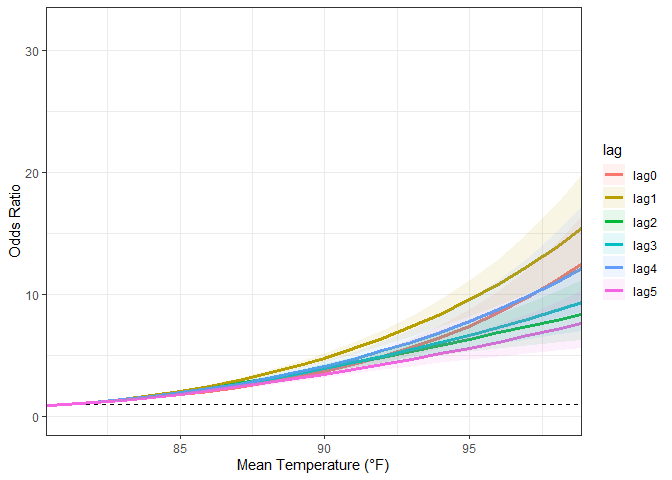

## Input data


```r
## cc-exposure df from `case_control_exposures.Rmd`

cc_exposure_df <-
  read_rds(file = "data/cc_exposure_df_rod.rds") %>% 
    filter(year %in% 1998:2019) 

daily_indices <-
  read_rds(file = "data/daily_indices_rod") 
```


## Inputs


```r
selected_index <- "tmp_f_mean"

# crossbasis options
set_lag <- 5    # total number days lag to assess
set_dr_df <- 5   # natural spline degrees of freedom for functional form of the dose-response curve
set_lag_df <- 4   # natural spline degrees of freedom for functional form of the lag

# crosspred options

set_increment <- 1   # crosspred "by = "

set_centered <- median(eval(parse(text = paste0("cc_exposure_df$", selected_index))), na.rm = TRUE)       #60     # crosspred "cen= ", centered value for odds ratios 


set_min_temp <- 32   # crosspred lower bound


# crosspred upper-bound
set_max_temp <- case_when(
  selected_index %in% "wbgt_f_mean" ~ 90,
  selected_index %in% "wbgt_f_max" ~ 110,
  selected_index %in% "hi_f_mean" ~ 110,
  selected_index %in% "hi_max" ~ 120,
  selected_index %in% "tmp_f_mean" ~ 105,
  selected_index %in% "tmp_f_max" ~ 120,
  selected_index %in% "tmp_f_min" ~ 90,
  selected_index %in% "hi_min" ~ 100,
  selected_index %in% "wbgt_min" ~ 84,
  selected_index %in% "tmp_f_0600" ~ 92,
  selected_index %in% "hi_f_0600" ~ 100 ,
  selected_index %in% "wbgt_f_0600" ~ 86 
        )

set_max_temp
```

```
## [1] 105
```

```r
# set max plot index value (approximate, or rounded-down from max value in dataset)
set_max_plot_value <- case_when(
  selected_index %in% "wbgt_f_mean" ~ 86,
  selected_index %in% "wbgt_f_max" ~ 104,
  selected_index %in% "hi_f_mean" ~ 104,
  selected_index %in% "hi_f_max" ~ 116,
  selected_index %in% "tmp_f_mean" ~ 98,
  selected_index %in% "tmp_f_max" ~ 112,
  selected_index %in% "tmp_f_min" ~ 88,
  selected_index %in% "hi_min" ~ 99,
  selected_index %in% "wbgt_min" ~ 82,
  selected_index %in% "tmp_f_0600" ~ 90,
  selected_index %in% "hi_f_0600" ~ 98,
  selected_index %in% "wbgt_f_0600" ~ 85
        )
    

set_max_plot_value
```

```
## [1] 98
```

```r
print_index <- case_when(
  selected_index %in% "wbgt_f_mean" ~ "Mean WBGT (°F)",
  selected_index %in% "wbgt_f_max" ~ "Maximum WBGT (°F)",
  selected_index %in% "hi_f_mean" ~ "Mean Heat Index (°F)",
  selected_index %in% "hi_f_max" ~ "Maximum Heat Index (°F)",
  selected_index %in% "tmp_f_mean" ~ "Mean Temperature (°F)",
  selected_index %in% "tmp_f_max" ~ "Maximum Temperature (°F)",
  selected_index %in% "wbgt_f_min" ~ "Minimum WBGT (°F)",
  selected_index %in% "wbgt_f_0600" ~ "WBGT 0600 Local (°F)",
  selected_index %in% "hi_f_min" ~ "Minimum Heat Index (°F)",
  selected_index %in% "hi_f_0600" ~ "Heat Index 0600 Local (°F)",
  selected_index %in% "tmp_f_min" ~ "Minimum Temperature (°F)",
  selected_index %in% "tmp_f_0600" ~ "Temperature 0600 Local (°F)"
    )


print_index
```

```
## [1] "Mean Temperature (°F)"
```

```r
print_index_c <- case_when(
  selected_index %in% "wbgt_f_mean" ~ "Mean WBGT (°C)",
  selected_index %in% "wbgt_f_max" ~ "Maximum WBGT (°C)",
  selected_index %in% "hi_f_mean" ~ "Mean Heat Index (°C)",
  selected_index %in% "hi_f_max" ~ "Maximum Heat Index (°C)",
  selected_index %in% "tmp_f_mean" ~ "Mean Temperature (°C)",
  selected_index %in% "tmp_f_max" ~ "Maximum Temperature (°C)",
  selected_index %in% "wbgt_f_min" ~ "Minimum WBGT (°C)",
  selected_index %in% "wbgt_f_0600" ~ "WBGT 0600 Local (°C)",
  selected_index %in% "hi_f_min" ~ "Minimum Heat Index (°C)",
  selected_index %in% "hi_f_0600" ~ "Heat Index 0600 Local (°C)",
  selected_index %in% "tmp_f_min" ~ "Minimum Temperature (°C)",
  selected_index %in% "tmp_f_0600" ~ "Temperature 0600 Local (°C)"
    )


print_index_c
```

```
## [1] "Mean Temperature (°C)"
```


## Lag function

```r
# DLNM
## Lags function

lags <- seq(set_lag) # Number of lags

lag_names <- paste("lag", formatC(lags, width = nchar(max(lags)), flag = "0"), 
  sep = "_")

lag_fun <- setNames(paste("dplyr::lag(., ", lags, ")"), lag_names)
```


## Create lag matrix for selected index; join to case-crossover dataframe


```r
 # create lag matrix

lag_matrix <-
  daily_indices %>%
    filter(date %in% as.Date("1997-12-15"):as.Date("2019-12-31")) %>%
      dplyr::select(site_name, date, selected_index) %>%
   group_by(site_name) %>%
   mutate_at(vars(selected_index), funs_(lag_fun)
  )
```

```
## Note: Using an external vector in selections is ambiguous.
## i Use `all_of(selected_index)` instead of `selected_index` to silence this message.
## i See <https://tidyselect.r-lib.org/reference/faq-external-vector.html>.
## This message is displayed once per session.
```

```r
# join lag matrix to case-crossover dataframe

cc_lag_matrix <-
 cc_exposure_df %>%
  dplyr::select(!selected_index) %>%    # remove to avoid double listing after join
 left_join(lag_matrix,  by = c("site_name", "date"))


cc_lag_only <- 
  cc_lag_matrix %>% 
  dplyr::select(selected_index, lag_1:paste0("lag_", set_lag))
```


## Define DLNM cross-basis


```r
# Define dlnm cross-basis (penalized splines)

index_cb <-
    crossbasis(
      cc_lag_only,    
      lag = set_lag,    # of lags
      argvar = list(fun = "ns", df = set_dr_df),    #  functional form of the dose-response curve
      arglag = list(fun = "ns", df = set_lag_df))    #  functional form of the lags

summary(index_cb)
```

```
## CROSSBASIS FUNCTIONS
## observations: 139875 
## range: 6.075833 to 100.9313 
## lag period: 0 5 
## total df:  20 
## 
## BASIS FOR VAR:
## fun: ns 
## knots: 68.54083 77.43958 81.255 84.4275 
## intercept: FALSE 
## Boundary.knots: 6.075833 100.9313 
## 
## BASIS FOR LAG:
## fun: ns 
## knots: 1.666667 3.333333 
## intercept: TRUE 
## Boundary.knots: 0 5
```

```r
# run model and get prediction for selected_index


index_dlnm <- survival::clogit(case ~
             index_cb +  # lagged, nonlinear term for exposure
             strata(stratum),
             method = "efron",
              data =  cc_exposure_df)


pred_dlnm <- crosspred(index_cb, index_dlnm, by = set_increment, from = set_min_temp, to = set_max_temp, cen = set_centered, cumul = TRUE)


summary(pred_dlnm)
```

```
## PREDICTIONS:
## values: 74 
## centered at: 81.23125 
## range: 32 , 105 
## lag: 0 5 
## exponentiated: yes 
## cumulative: yes 
## 
## MODEL:
## parameters: 20 
## class: clogit coxph 
## link: logit
```

## Odds ratio table 
(Relative to centered value)


```r
# pull designated values
pred_dlnm$allRRfit[c("74", "78", "80", "82", "84", "86", "90")]
```

```
##        74        78        80        82        84        86        90 
## 0.4029986 0.6529950 0.8409206 1.1253949 1.5546225 2.1022692 3.4656389
```

```r
# full range
  # allRRfit: vector of exponentiated overall cumulative associations from allfit.


assign(paste0("or_table_", selected_index),
  bind_cols(names(pred_dlnm$allRRfit), pred_dlnm$allRRfit, pred_dlnm$allRRlow, pred_dlnm$allRRhigh) %>% 
    dplyr::rename(var = 1, rr = 2, ci_low = 3, ci_high = 4) %>% 
    mutate(index = selected_index))
```

```
## New names:
## * `` -> `...1`
## * `` -> `...2`
## * `` -> `...3`
## * `` -> `...4`
```

```r
# write_rds(eval(parse(text = paste0("or_table_", selected_index))), 
#   file = paste0("output/", paste0("or_table_", selected_index), ".rds"))


eval(parse(text = paste0("or_table_", selected_index))) 
```

```
## # A tibble: 74 x 5
##    var       rr ci_low ci_high index     
##    <chr>  <dbl>  <dbl>   <dbl> <chr>     
##  1 32    0.0498 0.0389  0.0637 tmp_f_mean
##  2 33    0.0495 0.0391  0.0627 tmp_f_mean
##  3 34    0.0493 0.0393  0.0619 tmp_f_mean
##  4 35    0.0492 0.0395  0.0613 tmp_f_mean
##  5 36    0.0492 0.0398  0.0608 tmp_f_mean
##  6 37    0.0493 0.0402  0.0604 tmp_f_mean
##  7 38    0.0495 0.0406  0.0602 tmp_f_mean
##  8 39    0.0498 0.0411  0.0602 tmp_f_mean
##  9 40    0.0502 0.0417  0.0603 tmp_f_mean
## 10 41    0.0507 0.0424  0.0606 tmp_f_mean
## # ... with 64 more rows
```


## Plot model (ggplot)

```r
# As ggplot
  # https://www.rdocumentation.org/packages/season/versions/0.3.8/vignettes/season-vignette.Rmd link assisted with example "Plot of the temperature and death association averaging over all lags"

   # allRRfit: vector of exponentiated overall cumulative associations from allfit.
 
to_plot <- 
  data.frame(index = pred_dlnm$predvar, 
             mean = pred_dlnm$allRRfit,
             lower = pred_dlnm$allRRlow,
             upper = pred_dlnm$allRRhigh) %>% 
  filter(index <= set_max_plot_value)
  


assign(paste0("plot_", selected_index),
  ggplot(data = to_plot, aes(x = index, y = mean, ymin = lower, ymax = upper)) +
    geom_hline(lty = 2, yintercept = 1) + # horizontal reference line at no change in odds
    geom_ribbon(alpha = 0.2, fill = "cadetblue", color = "cadetblue") +
    geom_line(size = 1.25) +
    xlab(print_index) +
    ylab('Odds Ratio') +
    coord_cartesian(xlim = c(NA, set_max_plot_value)) +
    theme_bw() 
  )
    
# 
# write_rds(eval(parse(text = paste0("plot_", selected_index))), 
#   file = paste0("output/", paste0("plot_", selected_index), ".rds"))


eval(parse(text = paste0("plot_", selected_index))) +
  #  ggtitle(paste0("Daily ", print_index, " and HSI association cumulative over 0-", set_lag, " days lag")) +
    labs(caption = paste0("ORs relative to ",  print_index, " = ", set_centered)) +
    theme(plot.caption = element_text(hjust = 0))
```

<!-- -->


## Slice by lag day


```r
# Slice by lag
    # matRRfit: matrix of exponentiated specific associations from matfit
    # matfit: matrices of predictions and standard errors at the chosen combinations of predictor and lag values


to_plot_slice <- 
  pred_dlnm$matRRfit %>% 
    as.data.frame() %>% 
    rownames_to_column() %>% 
    rename(index_value = rowname) %>% 
    as_tibble() %>% 
    pivot_longer(-index_value, names_to = "lag", values_to = "OR") %>% 
  bind_cols(

    pred_dlnm$matRRlow %>% 
        as.data.frame() %>% 
        rownames_to_column() %>% 
        rename(index_value = rowname) %>% 
        as_tibble() %>% 
        pivot_longer(-index_value, names_to = "lag", values_to = "OR_low") %>% 
      dplyr::select(OR_low)
  ) %>% 
  bind_cols(
    
    pred_dlnm$matRRhigh %>% 
        as.data.frame() %>% 
        rownames_to_column() %>% 
        rename(index_value = rowname) %>% 
        as_tibble() %>% 
        pivot_longer(-index_value, names_to = "lag", values_to = "OR_high") %>% 
      dplyr::select(OR_high)
) %>% 
   mutate(index_value = as.numeric(index_value))


assign(paste0("plot_", selected_index, "_lag_slice"),
  ggplot(data = to_plot_slice, aes(x = index_value, color = lag)) +
    geom_hline(lty = 2, yintercept = 1) + # horizontal reference line at no change in odds
    geom_point(aes(y = OR)) +
    geom_line(aes(y = OR), size = 1.2) +
    geom_line(aes(y = OR_low), size = 0.5, linetype = "dashed") +
    geom_line(aes(y = OR_high), size = 0.5, linetype = "dashed") +
    xlab(print_index) +
    ylab('Odds Ratio') +
    coord_cartesian(xlim = c(set_centered, set_max_plot_value),
                    ylim = c(NA, max(to_plot_slice$OR, na.rm = TRUE))) +
    theme_bw() 
)
  
  
# write_rds(eval(parse(text = paste0("plot_", selected_index, "_lag_slice"))), 
#   file = paste0("output/", paste0("plot_", selected_index, "_lag_slice"), ".rds"))


eval(parse(text = paste0("plot_", selected_index, "_lag_slice"))) 
```

<!-- -->

```r
# Cumulative by lag  
  
    # cumRRfit: matrix of exponentiated incremental cumulative associations from cumfit
    # cumfit: matrices of incremental cumulative predicted associations along lags and related standard errors at the chosen combinations of predictor and (integer) lag values
  
  
to_plot_slice_cum <- 
  pred_dlnm$cumRRfit %>% 
    as.data.frame() %>% 
    rownames_to_column() %>% 
    rename(index_value = rowname) %>% 
    as_tibble() %>% 
    pivot_longer(-index_value, names_to = "lag", values_to = "OR") %>% 
  bind_cols(

    pred_dlnm$cumRRlow %>% 
        as.data.frame() %>% 
        rownames_to_column() %>% 
        rename(index_value = rowname) %>% 
        as_tibble() %>% 
        pivot_longer(-index_value, names_to = "lag", values_to = "OR_low") %>% 
      dplyr::select(OR_low)
  ) %>% 
  bind_cols(
    
    pred_dlnm$cumRRhigh %>% 
        as.data.frame() %>% 
        rownames_to_column() %>% 
        rename(index_value = rowname) %>% 
        as_tibble() %>% 
        pivot_longer(-index_value, names_to = "lag", values_to = "OR_high") %>% 
      dplyr::select(OR_high)
) %>% 
  mutate(index_value = as.numeric(index_value))


to_plot_slice_cum
```

```
## # A tibble: 444 x 5
##    index_value lag       OR OR_low OR_high
##          <dbl> <chr>  <dbl>  <dbl>   <dbl>
##  1          32 lag0  0.0607 0.0490  0.0752
##  2          32 lag1  0.0385 0.0313  0.0473
##  3          32 lag2  0.0586 0.0469  0.0731
##  4          32 lag3  0.0474 0.0379  0.0591
##  5          32 lag4  0.0338 0.0259  0.0439
##  6          32 lag5  0.0498 0.0389  0.0637
##  7          33 lag0  0.0605 0.0492  0.0744
##  8          33 lag1  0.0379 0.0310  0.0463
##  9          33 lag2  0.0573 0.0462  0.0710
## 10          33 lag3  0.0468 0.0378  0.0580
## # ... with 434 more rows
```

```r
# assign(paste0("plot_", selected_index, "_lag_slice_cum"),
#   ggplot(data = to_plot_slice_cum, aes(x = index_value, color = lag)) +
#     geom_hline(lty = 2, yintercept = 1) + # horizontal reference line at no change in odds
#     geom_point(aes(y = OR)) +
#     geom_line(aes(y = OR), size = 1.2) +
#     geom_line(aes(y = OR_low), size = 0.5, linetype = "dashed") +
#     geom_line(aes(y = OR_high), size = 0.5, linetype = "dashed") +
#     xlab(print_index) +
#     ylab('Odds Ratio') +
#     coord_cartesian(xlim = c(set_centered, set_max_plot_value),
#                     ylim = c(NA, max(to_plot_slice_cum$OR, na.rm = TRUE))) +
#     theme_bw() 
# )


assign(paste0("plot_", selected_index, "_lag_slice_cum"),
  ggplot(data = to_plot_slice_cum, aes(x = index_value, y = OR, ymin = OR_low, ymax = OR_high, color = lag, fill = lag)) +
    geom_hline(lty = 2, yintercept = 1) + # horizontal reference line at no change in odds
    geom_line(size = 1.25) +
    geom_ribbon(alpha = 0.1, color = NA) +
    xlab(print_index) +
    ylab('Odds Ratio') +
    coord_cartesian(xlim = c(set_centered, set_max_plot_value),
                    ylim = c(NA, max(to_plot_slice_cum$OR, na.rm = TRUE))) +
    theme_bw() 
)


paste0("plot_", selected_index, "_lag_slice_cum")
```

```
## [1] "plot_tmp_f_mean_lag_slice_cum"
```

```r
eval(parse(text = paste0("plot_", selected_index, "_lag_slice_cum"))) 
```

<!-- -->


## Nest by region
Nest `cc_exposure_df` by region


```r
# join lag matrix to case-crossover dataframe
# mutate new list-column for lag only matrix

assign(paste0(selected_index, "_nest_region"),
  cc_exposure_df %>%
    filter(year %in% 1998:2019) %>%
    dplyr::select(!selected_index) %>%    # remove to avoid double listing after join
    left_join(lag_matrix,  by = c("site_name", "date")) %>% 
    group_by(region) %>% 
    nest() %>% 
    rename(cc_lag_matrix = data) %>% 
    mutate(cc_lag_only =
             map(cc_lag_matrix, ~ .x %>% dplyr::select(selected_index, lag_1:paste0("lag_", set_lag))),
           index_cb = 
             map(cc_lag_only, ~ crossbasis(
                .x,    
                lag = set_lag,    # of lags
                argvar = list(fun = "ns", df = set_dr_df),    #  functional form of the dose-response curve
                arglag = list(fun = "ns", df = set_lag_df))                
              ),
           index_dlnm = 
             map2(.x = index_cb, .y = cc_lag_matrix,  ~ survival::clogit(case ~ 
                    .x +  # lagged, nonlinear term for exposure
                    strata(stratum), 
                    method = "efron",
                    data =  .y)),
            pred_dlnm = 
              map2(.x = index_cb, .y = index_dlnm, ~ crosspred(
                .x, .y, by = set_increment, from = set_min_temp, to = set_max_temp, cen = set_centered, cumul = TRUE)))
)  


eval(parse(text = paste0(selected_index, "_nest_region"))) 
```

```
## # A tibble: 4 x 6
## # Groups:   region [4]
##   region      cc_lag_matrix cc_lag_only index_cb        index_dlnm pred_dlnm 
##   <chr>       <list>        <list>      <list>          <list>     <list>    
## 1 Southeast   <tibble>      <tibble>    <crossbss[...]> <clogit>   <crossprd>
## 2 Ohio Valley <tibble>      <tibble>    <crossbss[...]> <clogit>   <crossprd>
## 3 South       <tibble>      <tibble>    <crossbss[...]> <clogit>   <crossprd>
## 4 West        <tibble>      <tibble>    <crossbss[...]> <clogit>   <crossprd>
```

```r
# Plot cumulative lag

to_plot_region <-
  eval(parse(text = paste0(selected_index, "_nest_region"))) %>% 
    mutate(to_plot = 
             map(.x = pred_dlnm, ~ 
                   data.frame(index = .x$predvar, 
                      mean = .x$allRRfit,
                      lower = .x$allRRlow,
                      upper = .x$allRRhigh))) %>% 
    dplyr::select(region, to_plot) %>% 
      unnest(to_plot) %>% 
  filter(index <= set_max_plot_value)


assign(paste0("plot_", selected_index, "_region"),
  ggplot(data = to_plot_region, aes(x = index, y = mean, ymin = lower, ymax = upper, color = region, fill = region)) +     
    geom_hline(lty = 2, yintercept = 1) + # horizontal reference line at no change in odds
    geom_ribbon(alpha = 0.1, colour = NA) +
    geom_line(size = 1.2) +
    xlab(print_index) +
    ylab('Odds Ratio') +
    coord_cartesian(xlim = c(NA, set_max_plot_value)) +
    #coord_cartesian(xlim = c(set_centered, set_max_plot_value), ylim = c(NA, max(to_plot_region$mean, na.rm = TRUE))) +
    theme_bw() 
)

# write_rds(eval(parse(text = paste0("plot_", selected_index, "_region"))), 
#   file = paste0("output/", paste0("plot_", selected_index, "_region"), ".rds"))


paste0("plot_", selected_index, "_region")
```

```
## [1] "plot_tmp_f_mean_region"
```

```r
eval(parse(text = paste0("plot_", selected_index, "_region"))) +
   # ggtitle(paste0("Daily ", print_index, " and HSI association \ncumulative over 0-5 days lag by NOAA NCEI climate region")) +
    labs(caption = paste0("ORs relative to ",  print_index, " = ", format(round(set_centered, digits = 1), nsmall = 1))) +
    theme(plot.caption = element_text(hjust = 0)) 
```

<!-- -->


## Nest by installation primary* branch of service

Note: there is overlap at sites (eg JBSA incl Lackland AFB and Fort Sam Houston)
Nest `cc_exposure_df` by `base_service`


```r
assign(paste0(selected_index, "_nest_service"),
  cc_exposure_df %>%
    filter(year %in% 1998:2019) %>%
    dplyr::select(!selected_index) %>%    # remove to avoid double listing after join
    left_join(lag_matrix,  by = c("site_name", "date")) %>% 
    group_by(base_service) %>% 
    nest() %>% 
    rename(cc_lag_matrix = data) %>% 
    mutate(cc_lag_only =
             map(cc_lag_matrix, ~ .x %>% dplyr::select(selected_index, lag_1:paste0("lag_", set_lag))),
           index_cb = 
             map(cc_lag_only, ~ crossbasis(
                .x,    
                lag = set_lag,    # of lags
                argvar = list(fun = "ns", df = set_dr_df),    #  functional form of the dose-response curve
                arglag = list(fun = "ns", df = set_lag_df))                
              ),
           index_dlnm = 
             map2(.x = index_cb, .y = cc_lag_matrix,  ~ survival::clogit(case ~ 
                    .x +  # lagged, nonlinear term for exposure
                    strata(stratum), 
                    method = "efron",
                    data =  .y)),
            pred_dlnm = 
              map2(.x = index_cb, .y = index_dlnm, ~ crosspred(
                .x, .y, by = set_increment, from = set_min_temp, to = set_max_temp, cen = set_centered, cumul = TRUE)))
)  

eval(parse(text = paste0(selected_index, "_nest_service"))) 
```

```
## # A tibble: 4 x 6
## # Groups:   base_service [4]
##   base_service cc_lag_matrix cc_lag_only index_cb        index_dlnm pred_dlnm 
##   <chr>        <list>        <list>      <list>          <list>     <list>    
## 1 Army         <tibble>      <tibble>    <crossbss[...]> <clogit>   <crossprd>
## 2 Marine Corps <tibble>      <tibble>    <crossbss[...]> <clogit>   <crossprd>
## 3 Air Force    <tibble>      <tibble>    <crossbss[...]> <clogit>   <crossprd>
## 4 Navy         <tibble>      <tibble>    <crossbss[...]> <clogit>   <crossprd>
```

```r
# Plot cumulative lag

to_plot_service <-
  eval(parse(text = paste0(selected_index, "_nest_service"))) %>% 
    mutate(to_plot = 
             map(.x = pred_dlnm, ~ 
                   data.frame(index = .x$predvar, 
                      mean = .x$allRRfit,
                      lower = .x$allRRlow,
                      upper = .x$allRRhigh))) %>% 
    dplyr::select(base_service, to_plot) %>% 
      unnest(to_plot) %>% 
  filter(index <= set_max_plot_value)


assign(paste0("plot_", selected_index, "_service"),
  ggplot(data = to_plot_service, aes(x = index, y = mean, ymin = lower, ymax = upper, color = base_service, fill = base_service)) +
    geom_hline(lty = 2, yintercept = 1) + # horizontal reference line at no change in odds
    geom_ribbon(alpha = 0.1, colour = NA) +
    geom_line(size = 1.25) +
    xlab(print_index) +
    ylab('Odds Ratio') +
    coord_cartesian(xlim = c(set_centered, set_max_plot_value), ylim = c(NA, max(to_plot_service$mean, na.rm = TRUE))) +
    theme_bw() 
)

# write_rds(eval(parse(text = paste0("plot_", selected_index, "_service"))), 
#   file = paste0("output/", paste0("plot_", selected_index, "_service"), ".rds"))


eval(parse(text = paste0("plot_", selected_index, "_service"))) +
    labs(caption = paste0("ORs relative to ",  print_index, " = ", set_centered)) +
    theme(plot.caption = element_text(hjust = 0)) 
```

<!-- -->


## Nest by HSI type


```r
# join lag matrix to case-crossover dataframe
# mutate new list-column for lag only matrix

assign(paste0(selected_index, "_nest_hsi"),
  cc_exposure_df %>%
    filter(year %in% 1998:2019) %>%
    mutate(hsi = recode(hsi, heat_stroke = "heat stroke",
                             heat_exhaustion = "heat exhaustion"),
           hsi = as_factor(hsi),
           hsi = fct_relevel(hsi, c("heat stroke", "heat exhaustion"))) %>% 
    dplyr::select(!selected_index) %>%    # remove to avoid double listing after join
    left_join(lag_matrix,  by = c("site_name", "date")) %>% 
    group_by(hsi) %>% 
    nest() %>% 
    rename(cc_lag_matrix = data) %>% 
    mutate(cc_lag_only =
             map(cc_lag_matrix, ~ .x %>% dplyr::select(selected_index, lag_1:paste0("lag_", set_lag))),
           index_cb = 
             map(cc_lag_only, ~ crossbasis(
                .x,    
                lag = set_lag,    # of lags
                argvar = list(fun = "ns", df = set_dr_df),    #  functional form of the dose-response curve
                arglag = list(fun = "ns", df = set_lag_df))                
              ),
           index_dlnm = 
             map2(.x = index_cb, .y = cc_lag_matrix,  ~ survival::clogit(case ~ 
                    .x +  # lagged, nonlinear term for exposure
                    strata(stratum), 
                    method = "efron",
                    data =  .y)),
            pred_dlnm = 
              map2(.x = index_cb, .y = index_dlnm, ~ crosspred(
                .x, .y, by = set_increment, from = set_min_temp, to = set_max_temp, cen = set_centered, cumul = TRUE)))
)  

eval(parse(text = paste0(selected_index, "_nest_hsi"))) 
```

```
## # A tibble: 2 x 6
## # Groups:   hsi [2]
##   hsi            cc_lag_matrix cc_lag_only index_cb        index_dlnm pred_dlnm 
##   <fct>          <list>        <list>      <list>          <list>     <list>    
## 1 heat exhausti~ <tibble>      <tibble>    <crossbss[...]> <clogit>   <crossprd>
## 2 heat stroke    <tibble>      <tibble>    <crossbss[...]> <clogit>   <crossprd>
```

```r
# Plot cumulative lag

to_plot_hsi<-
  eval(parse(text = paste0(selected_index, "_nest_hsi"))) %>% 
    mutate(to_plot = 
             map(.x = pred_dlnm, ~ 
                   data.frame(index = .x$predvar, 
                      mean = .x$allRRfit,
                      lower = .x$allRRlow,
                      upper = .x$allRRhigh))) %>% 
    dplyr::select(hsi, to_plot) %>% 
      unnest(to_plot) %>% 
  filter(index <= set_max_plot_value)


assign(paste0("plot_", selected_index, "_hsi"),
  ggplot(data = to_plot_hsi, aes(x = index, y = mean, ymin = lower, ymax = upper, color = hsi, fill = hsi)) +
    geom_hline(lty = 2, yintercept = 1) + # horizontal reference line at no change in odds
    geom_ribbon(alpha = 0.1, colour = NA) +
    geom_line(size = 1.25) +
    xlab(print_index) +
    ylab('Odds Ratio') +
    coord_cartesian(xlim = c(NA, set_max_plot_value)) +
    #coord_cartesian(xlim = c(set_centered, set_max_plot_value), ylim = c(NA, max(to_plot_hsi$mean, na.rm = TRUE))) +
    theme_bw() +
    labs(color = 'type') +
    guides(fill = FALSE)
)

# write_rds(eval(parse(text = paste0("plot_", selected_index, "_hsi"))), 
#   file = paste0("output/", paste0("plot_", selected_index, "_hsi"), ".rds"))


eval(parse(text = paste0("plot_", selected_index, "_hsi"))) +
   # ggtitle(paste0("Daily ", print_index, " and HSI association \ncumulative over 0-5 days lag by HSI type")) +
    labs(caption = paste0("ORs relative to ",  print_index, " = ", format(round(set_centered, digits = 1), nsmall = 1))) +
    theme(plot.caption = element_text(hjust = 0)) 
```

<!-- -->


## Nest by HSI encounter source
Nest `cc_exposure_df` by region


```r
# join lag matrix to case-crossover dataframe
# mutate new list-column for lag only matrix

assign(paste0(selected_index, "_nest_source"),
  cc_exposure_df %>%
    filter(year %in% 1998:2019) %>%
    dplyr::select(!selected_index) %>%    # remove to avoid double listing after join
    left_join(lag_matrix,  by = c("site_name", "date")) %>% 
    group_by(source) %>% 
    nest() %>% 
    rename(cc_lag_matrix = data) %>% 
    mutate(cc_lag_only =
             map(cc_lag_matrix, ~ .x %>% dplyr::select(selected_index, lag_1:paste0("lag_", set_lag))),
           index_cb = 
             map(cc_lag_only, ~ crossbasis(
                .x,    
                lag = set_lag,    # of lags
                argvar = list(fun = "ns", df = set_dr_df),    #  functional form of the dose-response curve
                arglag = list(fun = "ns", df = set_lag_df))                
              ),
           index_dlnm = 
             map2(.x = index_cb, .y = cc_lag_matrix,  ~ survival::clogit(case ~ 
                    .x +  # lagged, nonlinear term for exposure
                    strata(stratum), 
                    method = "efron",
                    data =  .y)),
            pred_dlnm = 
              map2(.x = index_cb, .y = index_dlnm, ~ crosspred(
                .x, .y, by = set_increment, from = set_min_temp, to = set_max_temp, cen = set_centered, cumul = TRUE)))
)  

eval(parse(text = paste0(selected_index, "_nest_source"))) 
```

```
## # A tibble: 3 x 6
## # Groups:   source [3]
##   source     cc_lag_matrix cc_lag_only index_cb        index_dlnm pred_dlnm 
##   <chr>      <list>        <list>      <list>          <list>     <list>    
## 1 INPATIENT  <tibble>      <tibble>    <crossbss[...]> <clogit>   <crossprd>
## 2 OUTPATIENT <tibble>      <tibble>    <crossbss[...]> <clogit>   <crossprd>
## 3 RME        <tibble>      <tibble>    <crossbss[...]> <clogit>   <crossprd>
```

```r
# Plot cumulative lag

to_plot_source<-
  eval(parse(text = paste0(selected_index, "_nest_source"))) %>% 
    mutate(to_plot = 
             map(.x = pred_dlnm, ~ 
                   data.frame(index = .x$predvar, 
                      mean = .x$allRRfit,
                      lower = .x$allRRlow,
                      upper = .x$allRRhigh))) %>% 
    dplyr::select(source, to_plot) %>% 
      unnest(to_plot) %>% 
  filter(index <= set_max_plot_value)


assign(paste0("plot_", selected_index, "_source"),
  ggplot(data = to_plot_source, aes(x = index, y = mean, ymin = lower, ymax = upper, color = source, fill = source)) +
    geom_hline(lty = 2, yintercept = 1) + # horizontal reference line at no change in odds
    geom_ribbon(alpha = 0.1, colour = NA) +
    geom_line(size = 1.25) +
    xlab(print_index) +
    ylab('Odds Ratio') +
    coord_cartesian(xlim = c(set_centered, set_max_plot_value), ylim = c(NA, max(to_plot_source$mean, na.rm = TRUE))) +
    theme_bw() 
)

# write_rds(eval(parse(text = paste0("plot_", selected_index, "_source"))), 
#   file = paste0("output/", paste0("plot_", selected_index, "_source"), ".rds"))


eval(parse(text = paste0("plot_", selected_index, "_source"))) +
    ggtitle(paste0("Daily ", print_index, " and HSI association \ncumulative over 0-5 days lag by HSI encounter source")) +
    labs(caption = paste0("ORs relative to ",  print_index, " = ", set_centered)) +
    theme(plot.caption = element_text(hjust = 0)) 
```

<!-- -->


## Nest by installation


```r
assign(paste0(selected_index, "_nest_base"),
  cc_exposure_df %>%
    filter(year %in% 1998:2019) %>%
    dplyr::select(!selected_index) %>%    # remove to avoid double listing after join
    left_join(lag_matrix,  by = c("site_name", "date")) %>% 
    group_by(site_name) %>% 
    nest() %>% 
    rename(cc_lag_matrix = data) %>% 
    mutate(cc_lag_only =
             map(cc_lag_matrix, ~ .x %>% dplyr::select(selected_index, lag_1:paste0("lag_", set_lag))),
           index_cb = 
             map(cc_lag_only, ~ crossbasis(
                .x,    
                lag = set_lag,    # of lags
                argvar = list(fun = "ns", df = set_dr_df),    #  functional form of the dose-response curve
                arglag = list(fun = "ns", df = set_lag_df))                
              ),
           index_dlnm = 
             map2(.x = index_cb, .y = cc_lag_matrix,  ~ survival::clogit(case ~ 
                    .x +  # lagged, nonlinear term for exposure
                    strata(stratum), 
                    method = "efron",
                    data =  .y)),
            pred_dlnm = 
              map2(.x = index_cb, .y = index_dlnm, ~ crosspred(
                .x, .y, by = set_increment, from = set_min_temp, to = set_max_temp, cen = set_centered, cumul = TRUE)))
)  

eval(parse(text = paste0(selected_index, "_nest_base"))) 
```

```
## # A tibble: 24 x 6
## # Groups:   site_name [24]
##    site_name     cc_lag_matrix cc_lag_only index_cb        index_dlnm pred_dlnm 
##    <chr>         <list>        <list>      <list>          <list>     <list>    
##  1 Fort Benning  <tibble>      <tibble>    <crossbss[...]> <clogit>   <crossprd>
##  2 Fort Bragg    <tibble>      <tibble>    <crossbss[...]> <clogit>   <crossprd>
##  3 MCB Camp Lej~ <tibble>      <tibble>    <crossbss[...]> <clogit>   <crossprd>
##  4 MCRD Parris ~ <tibble>      <tibble>    <crossbss[...]> <clogit>   <crossprd>
##  5 Fort Campbell <tibble>      <tibble>    <crossbss[...]> <clogit>   <crossprd>
##  6 Fort Polk     <tibble>      <tibble>    <crossbss[...]> <clogit>   <crossprd>
##  7 Fort Jackson  <tibble>      <tibble>    <crossbss[...]> <clogit>   <crossprd>
##  8 MCB Camp Pen~ <tibble>      <tibble>    <crossbss[...]> <clogit>   <crossprd>
##  9 Fort Hood     <tibble>      <tibble>    <crossbss[...]> <clogit>   <crossprd>
## 10 MCRD San Die~ <tibble>      <tibble>    <crossbss[...]> <clogit>   <crossprd>
## # ... with 14 more rows
```

```r
# Plot cumulative lag

to_plot_base <-
  eval(parse(text = paste0(selected_index, "_nest_base"))) %>% 
    mutate(to_plot = 
             map(.x = pred_dlnm, ~ 
                   data.frame(index = .x$predvar, 
                      mean = .x$allRRfit,
                      lower = .x$allRRlow,
                      upper = .x$allRRhigh))) %>% 
    dplyr::select(site_name, to_plot) %>% 
      unnest(to_plot) %>% 
  filter(index <= set_max_plot_value)


assign(paste0("plot_", selected_index, "_base"),
  ggplot(data = to_plot_base, aes(x = index, y = mean, ymin = lower, ymax = upper, color = site_name, fill = site_name)) +
    geom_hline(lty = 2, yintercept = 1) + # horizontal reference line at no change in odds
    geom_ribbon(alpha = 0.05, colour = NA) +
    geom_line(size = 1.25) +
    xlab(print_index) +
    ylab('Odds Ratio') +
    coord_cartesian(xlim = c(set_centered, set_max_plot_value), ylim = c(NA, max(to_plot_base$mean, na.rm = TRUE))) +
    theme_bw() 
)

# write_rds(eval(parse(text = paste0("plot_", selected_index, "_base"))), 
#   file = paste0("output/", paste0("plot_", selected_index, "_base"), ".rds"))


eval(parse(text = paste0("plot_", selected_index, "_base"))) +
    ggtitle(paste0("Daily ", print_index, " and HSI association \ncumulative over 0-5 days lag by installation")) +
    labs(caption = paste0("ORs relative to ",  print_index, " = ", set_centered)) +
    theme(plot.caption = element_text(hjust = 0)) 
```

<!-- -->

