Case-crossover models (DLNM) mapped over set of index variables. 


## Input data


```r
## cc-exposure df from `case_control_exposures.Rmd`

cc_exposure_df <-
  read_rds(file = "data/cc_exposure_df_rod.rds") %>% 
    filter(year %in% 1998:2019) 

daily_indices <-
  read_rds(file = "data/daily_indices_rod") 
```


## Inputs


```r
selected_index <- c("tmp_f_mean", "tmp_f_max", "tmp_f_min", "tmp_f_0600", "hi_f_mean", "hi_f_max", "hi_f_min", "hi_f_0600",
                    "wbgt_f_mean", "wbgt_f_max", "wbgt_f_min", "wbgt_f_0600")

# crossbasis options
set_lag <- 5    # total number days lag to assess
set_dr_df <- 5   # natural spline degrees of freedom for functional form of the dose-response curve
set_lag_df <- 4   # natural spline degrees of freedom for functional form of the lag

# crosspred options

set_increment <- 1   # crosspred "by = "
# set_centered <- median(eval(parse(text = paste0("cc_exposure_df$", selected_index))))       #60     # crosspred "cen= ", centered value for odds ratios 
set_min_temp <- 32   # crosspred lower bound


## Lag function


# DLNM
## Lags function

lags <- seq(set_lag) # Number of lags

lag_names <- paste("lag", formatC(lags, width = nchar(max(lags)), flag = "0"), 
  sep = "_")

lag_fun <- setNames(paste("dplyr::lag(., ", lags, ")"), lag_names)
```


## Create lag matrix for selected index; join to case-crossover dataframe


```r
 # create lag matrix


cc_dlnm_fun <-  function(selected_index) {

lag_matrix <-
  daily_indices %>%
    filter(date %in% as.Date("1997-12-15"):as.Date("2019-12-31")) %>%
      dplyr::select(site_name, date, selected_index) %>%
   group_by(site_name) %>%
   mutate_at(vars(selected_index), funs_(lag_fun)
  )


# join lag matrix to case-crossover dataframe

cc_lag_matrix <-
 cc_exposure_df %>%
  dplyr::select(!selected_index) %>%    # remove to avoid double listing after join
 left_join(lag_matrix,  by = c("site_name", "date"))


cc_lag_only <- 
  cc_lag_matrix %>% 
  dplyr::select(selected_index, lag_1:paste0("lag_", set_lag))


# Define dlnm cross-basis (penalized splines)

index_cb <-
    crossbasis(
      cc_lag_only,    
      lag = set_lag,    # of lags
      argvar = list(fun = "ns", df = set_dr_df),    #  functional form of the dose-response curve
      arglag = list(fun = "ns", df = set_lag_df))    #  functional form of the lags

# run model and get prediction for selected_index

index_dlnm <- survival::clogit(case ~
             index_cb +  # lagged, nonlinear term for exposure
             strata(stratum),
             method = "efron",
              data =  cc_exposure_df)


# centered value from index median

set_centered <- median(eval(parse(text = paste0("cc_exposure_df$", selected_index))))  

# max_temp based on selected index

# crosspred upper-bound
set_max_temp <- case_when(
  selected_index %in% "wbgt_f_mean" ~ 90,
  selected_index %in% "wbgt_f_max" ~ 110,
  selected_index %in% "hi_f_mean" ~ 110,
  selected_index %in% "hi_f_max" ~ 120,
  selected_index %in% "tmp_f_mean" ~ 105,
  selected_index %in% "tmp_f_max" ~ 120,
  selected_index %in% "tmp_f_min" ~ 90,
  selected_index %in% "hi_f_min" ~ 100,
  selected_index %in% "wbgt_f_min" ~ 84,
  selected_index %in% "tmp_f_0600" ~ 92,
  selected_index %in% "hi_f_0600" ~ 100 ,
  selected_index %in% "wbgt_f_0600" ~ 86 
        )


# set max plot index value (approximate, or rounded-down from max value in dataset)
set_max_plot_value <- case_when(
  selected_index %in% "wbgt_f_mean" ~ 86,
  selected_index %in% "wbgt_f_max" ~ 104,
  selected_index %in% "hi_f_mean" ~ 104,
  selected_index %in% "hi_f_max" ~ 116,
  selected_index %in% "tmp_f_mean" ~ 98,
  selected_index %in% "tmp_f_max" ~ 112,
  selected_index %in% "tmp_f_min" ~ 88,
  selected_index %in% "hi_f_min" ~ 99,
  selected_index %in% "wbgt_f_min" ~ 82,
  selected_index %in% "tmp_f_0600" ~ 90,
  selected_index %in% "hi_f_0600" ~ 98,
  selected_index %in% "wbgt_f_0600" ~ 85
        )
    
print_index <- case_when(
  selected_index %in% "wbgt_f_mean" ~ "Mean WBGT (°F)",
  selected_index %in% "wbgt_f_max" ~ "Maximum WBGT (°F)",
  selected_index %in% "hi_f_mean" ~ "Mean Heat Index (°F)",
  selected_index %in% "hi_f_max" ~ "Maximum Heat Index (°F)",
  selected_index %in% "tmp_f_mean" ~ "Mean Temperature (°F)",
  selected_index %in% "tmp_f_max" ~ "Maximum Temperature (°F)",
  selected_index %in% "wbgt_f_min" ~ "Minimum WBGT (°F)",
  selected_index %in% "wbgt_f_0600" ~ "WBGT 0600 Local (°F)",
  selected_index %in% "hi_f_min" ~ "Minimum Heat Index (°F)",
  selected_index %in% "hi_f_0600" ~ "Heat Index 0600 Local (°F)",
  selected_index %in% "tmp_f_min" ~ "Minimum Temperature (°F)",
  selected_index %in% "tmp_f_0600" ~ "Temperature 0600 Local (°F)"
    )

print_index_c <- case_when(
  selected_index %in% "wbgt_f_mean" ~ "Mean WBGT (°C)",
  selected_index %in% "wbgt_f_max" ~ "Maximum WBGT (°C)",
  selected_index %in% "hi_f_mean" ~ "Mean Heat Index (°C)",
  selected_index %in% "hi_f_max" ~ "Maximum Heat Index (°C)",
  selected_index %in% "tmp_f_mean" ~ "Mean Temperature (°C)",
  selected_index %in% "tmp_f_max" ~ "Maximum Temperature (°C)",
  selected_index %in% "wbgt_f_min" ~ "Minimum WBGT (°C)",
  selected_index %in% "wbgt_f_0600" ~ "WBGT 0600 Local (°C)",
  selected_index %in% "hi_f_min" ~ "Minimum Heat Index (°C)",
  selected_index %in% "hi_f_0600" ~ "Heat Index 0600 Local (°C)",
  selected_index %in% "tmp_f_min" ~ "Minimum Temperature (°C)",
  selected_index %in% "tmp_f_0600" ~ "Temperature 0600 Local (°C)"
    )


# DLNM cross-prediction

pred_dlnm <- crosspred(index_cb, index_dlnm, by = set_increment, from = set_min_temp, to = set_max_temp, cen = set_centered, cumul = TRUE)


## Odds ratio table ,(Relative to centered value)
  # allRRfit: vector of exponentiated overall cumulative associations from allfit.


assign(paste0("or_table_", selected_index),
  bind_cols(names(pred_dlnm$allRRfit), pred_dlnm$allRRfit, pred_dlnm$allRRlow, pred_dlnm$allRRhigh) %>% 
    dplyr::rename(var = 1, rr = 2, ci_low = 3, ci_high = 4) %>% 
    mutate(index = selected_index)
)


# write_rds(eval(parse(text = paste0("or_table_", selected_index))), 
#   file = paste0("output/", paste0("or_table_", selected_index), ".rds"))


#eval(parse(text = paste0("or_table_", selected_index))) %>% knitr::kable()

## Plot model (ggplot)

 to_plot <- 
  data.frame(index = pred_dlnm$predvar, 
             mean = pred_dlnm$allRRfit,
             lower = pred_dlnm$allRRlow,
             upper = pred_dlnm$allRRhigh) %>% 
  filter(index <= set_max_plot_value)
  

# Add dual scale (deg C) 

assign(paste0("plot_", selected_index),
  ggplot(data = to_plot, aes(x = index, y = mean, ymin = lower, ymax = upper)) +
    geom_hline(lty = 2, yintercept = 1) + # horizontal reference line at no change in odds
    geom_ribbon(alpha = 0.4, fill = "cadetblue", color = "cadetblue") +
    geom_line(size = 1.25) +
    # geom_point(aes(x = set_centered, y = 1), size = 2.5) +
    # geom_text(aes(x = set_centered, y = 1, label = format(round(set_centered, digits = 1), nsmall = 1)),
    #           nudge_x = -2,
    #           nudge_y = 0.25,
    #           size = 4) +
    ylab('Odds Ratio') +
    labs(caption = paste0("Centered at ", format(round(set_centered, digits = 1), nsmall = 1), " °F")) +
    #labs(subtitle = paste0("Centered at ", format(round(set_centered, digits = 1), nsmall = 1))) +
    coord_cartesian(xlim = c(NA, set_max_plot_value)) +
    scale_x_continuous(print_index, sec.axis = sec_axis(trans = ~ (5/9) * (. - 32), name = print_index_c, breaks = seq(from = -20, to = 60, by = 5))) + 
        theme_bw() 
  )


# write_rds(eval(parse(text = paste0("plot_", selected_index))), 
#   file = paste0("output/", paste0("plot_", selected_index), ".rds"))


eval(parse(text = paste0("plot_", selected_index)))

#ggsave(file = paste0("output/", paste0("plot_", selected_index), ".tiff"))

}
```


## Map function

```r
purrr::map(selected_index, cc_dlnm_fun) 
```

```
## Note: Using an external vector in selections is ambiguous.
## i Use `all_of(selected_index)` instead of `selected_index` to silence this message.
## i See <https://tidyselect.r-lib.org/reference/faq-external-vector.html>.
## This message is displayed once per session.
```

```
## Warning: `funs_()` was deprecated in dplyr 0.7.0.
## Please use `funs()` instead.
## See vignette('programming') for more help
## This warning is displayed once every 8 hours.
## Call `lifecycle::last_lifecycle_warnings()` to see where this warning was generated.
```

```
## Warning: `funs()` was deprecated in dplyr 0.8.0.
## Please use a list of either functions or lambdas: 
## 
##   # Simple named list: 
##   list(mean = mean, median = median)
## 
##   # Auto named with `tibble::lst()`: 
##   tibble::lst(mean, median)
## 
##   # Using lambdas
##   list(~ mean(., trim = .2), ~ median(., na.rm = TRUE))
## This warning is displayed once every 8 hours.
## Call `lifecycle::last_lifecycle_warnings()` to see where this warning was generated.
```

```
## Warning in (function (fun = NULL, df = NULL, knots = NULL, ...) : default knots placement along lags has changed since version 2.0.0.
## See 'file.show(system.file('Changesince200',package='dlnm'))'.
## See also help(logknots) for setting the knots
## consistently with the previous versions
```

```
## New names:
## * `` -> `...1`
## * `` -> `...2`
## * `` -> `...3`
## * `` -> `...4`
```

```
## Warning in (function (fun = NULL, df = NULL, knots = NULL, ...) : default knots placement along lags has changed since version 2.0.0.
## See 'file.show(system.file('Changesince200',package='dlnm'))'.
## See also help(logknots) for setting the knots
## consistently with the previous versions
```

```
## New names:
## * `` -> `...1`
## * `` -> `...2`
## * `` -> `...3`
## * `` -> `...4`
```

```
## Warning in (function (fun = NULL, df = NULL, knots = NULL, ...) : default knots placement along lags has changed since version 2.0.0.
## See 'file.show(system.file('Changesince200',package='dlnm'))'.
## See also help(logknots) for setting the knots
## consistently with the previous versions
```

```
## New names:
## * `` -> `...1`
## * `` -> `...2`
## * `` -> `...3`
## * `` -> `...4`
```

```
## Warning in (function (fun = NULL, df = NULL, knots = NULL, ...) : default knots placement along lags has changed since version 2.0.0.
## See 'file.show(system.file('Changesince200',package='dlnm'))'.
## See also help(logknots) for setting the knots
## consistently with the previous versions
```

```
## New names:
## * `` -> `...1`
## * `` -> `...2`
## * `` -> `...3`
## * `` -> `...4`
```

```
## Warning in (function (fun = NULL, df = NULL, knots = NULL, ...) : default knots placement along lags has changed since version 2.0.0.
## See 'file.show(system.file('Changesince200',package='dlnm'))'.
## See also help(logknots) for setting the knots
## consistently with the previous versions
```

```
## New names:
## * `` -> `...1`
## * `` -> `...2`
## * `` -> `...3`
## * `` -> `...4`
```

```
## Warning in (function (fun = NULL, df = NULL, knots = NULL, ...) : default knots placement along lags has changed since version 2.0.0.
## See 'file.show(system.file('Changesince200',package='dlnm'))'.
## See also help(logknots) for setting the knots
## consistently with the previous versions
```

```
## New names:
## * `` -> `...1`
## * `` -> `...2`
## * `` -> `...3`
## * `` -> `...4`
```

```
## Warning in (function (fun = NULL, df = NULL, knots = NULL, ...) : default knots placement along lags has changed since version 2.0.0.
## See 'file.show(system.file('Changesince200',package='dlnm'))'.
## See also help(logknots) for setting the knots
## consistently with the previous versions
```

```
## New names:
## * `` -> `...1`
## * `` -> `...2`
## * `` -> `...3`
## * `` -> `...4`
```

```
## Warning in (function (fun = NULL, df = NULL, knots = NULL, ...) : default knots placement along lags has changed since version 2.0.0.
## See 'file.show(system.file('Changesince200',package='dlnm'))'.
## See also help(logknots) for setting the knots
## consistently with the previous versions
```

```
## New names:
## * `` -> `...1`
## * `` -> `...2`
## * `` -> `...3`
## * `` -> `...4`
```

```
## Warning in (function (fun = NULL, df = NULL, knots = NULL, ...) : default knots placement along lags has changed since version 2.0.0.
## See 'file.show(system.file('Changesince200',package='dlnm'))'.
## See also help(logknots) for setting the knots
## consistently with the previous versions
```

```
## New names:
## * `` -> `...1`
## * `` -> `...2`
## * `` -> `...3`
## * `` -> `...4`
```

```
## Warning in (function (fun = NULL, df = NULL, knots = NULL, ...) : default knots placement along lags has changed since version 2.0.0.
## See 'file.show(system.file('Changesince200',package='dlnm'))'.
## See also help(logknots) for setting the knots
## consistently with the previous versions
```

```
## New names:
## * `` -> `...1`
## * `` -> `...2`
## * `` -> `...3`
## * `` -> `...4`
```

```
## Warning in (function (fun = NULL, df = NULL, knots = NULL, ...) : default knots placement along lags has changed since version 2.0.0.
## See 'file.show(system.file('Changesince200',package='dlnm'))'.
## See also help(logknots) for setting the knots
## consistently with the previous versions
```

```
## New names:
## * `` -> `...1`
## * `` -> `...2`
## * `` -> `...3`
## * `` -> `...4`
```

```
## Warning in (function (fun = NULL, df = NULL, knots = NULL, ...) : default knots placement along lags has changed since version 2.0.0.
## See 'file.show(system.file('Changesince200',package='dlnm'))'.
## See also help(logknots) for setting the knots
## consistently with the previous versions
```

```
## New names:
## * `` -> `...1`
## * `` -> `...2`
## * `` -> `...3`
## * `` -> `...4`
```

```
## [[1]]
```

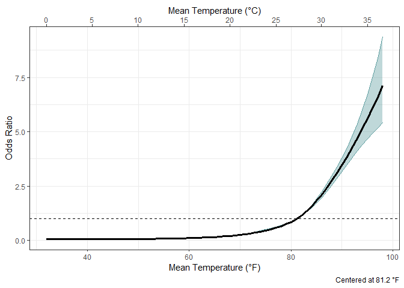<!-- -->

```
## 
## [[2]]
```

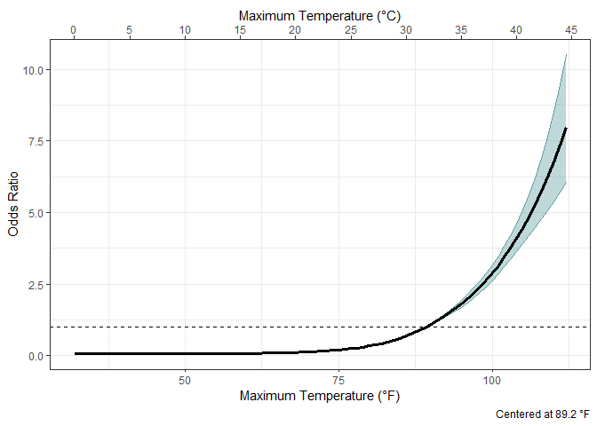<!-- -->

```
## 
## [[3]]
```

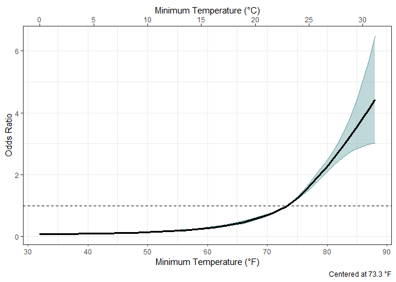<!-- -->

```
## 
## [[4]]
```

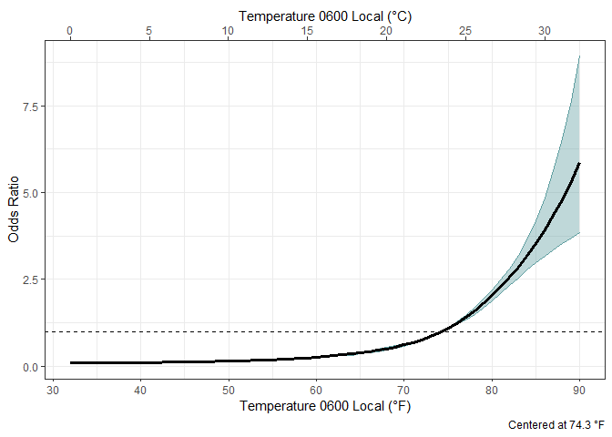<!-- -->

```
## 
## [[5]]
```

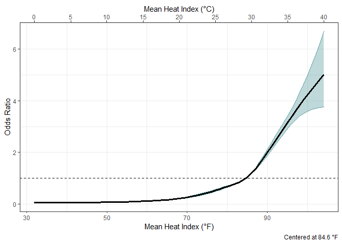<!-- -->

```
## 
## [[6]]
```

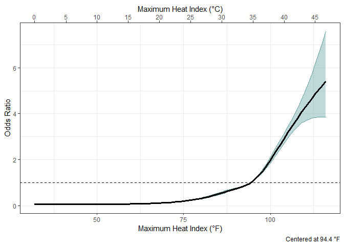<!-- -->

```
## 
## [[7]]
```

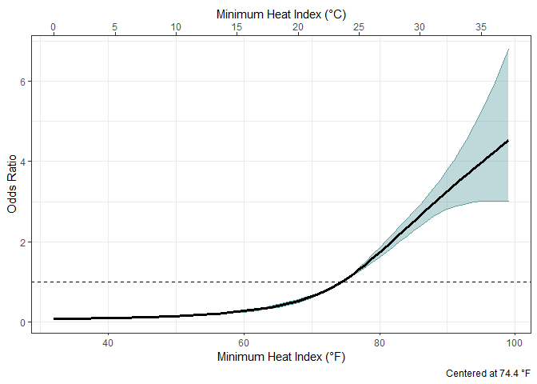<!-- -->

```
## 
## [[8]]
```

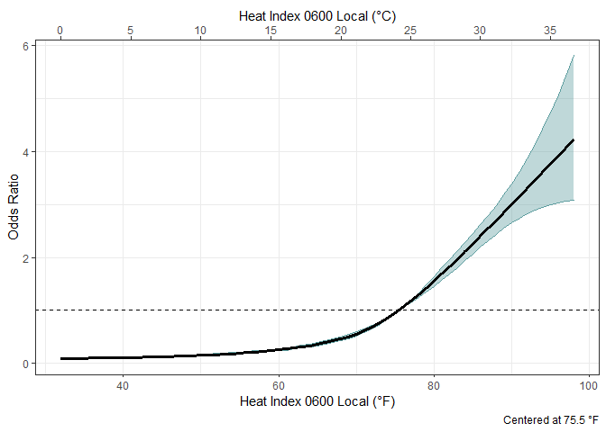<!-- -->

```
## 
## [[9]]
```

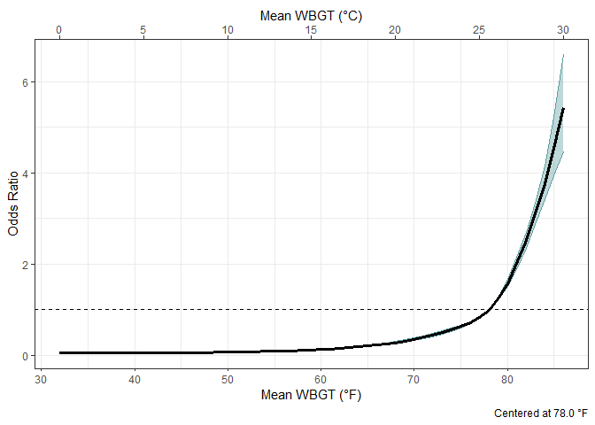<!-- -->

```
## 
## [[10]]
```

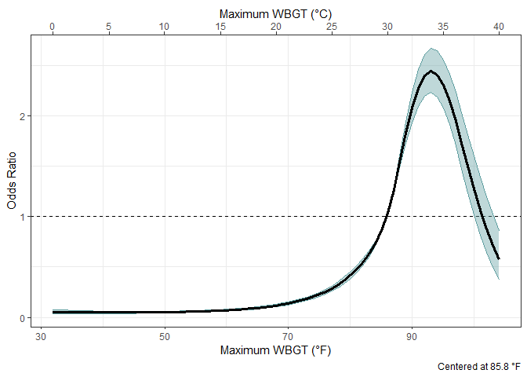<!-- -->

```
## 
## [[11]]
```

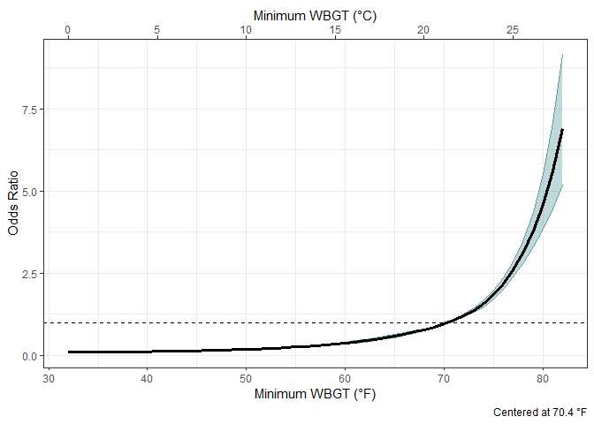<!-- -->

```
## 
## [[12]]
```

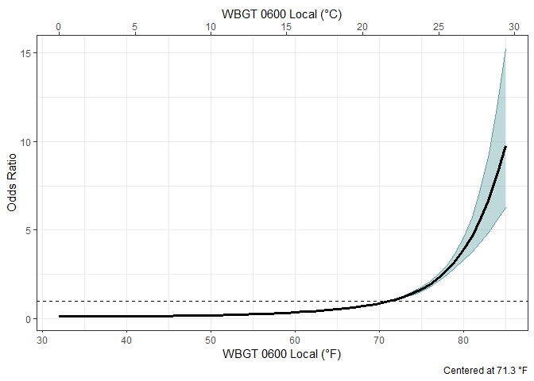<!-- -->


