Case-crossover models (DLNM) mapped over set of index variables - plot lag slices


## Input data


```r
## cc-exposure df from `case_control_exposures.Rmd`

cc_exposure_df <-
  read_rds(file = "data/cc_exposure_df_rod.rds") %>% 
    filter(year %in% 1998:2019) 

daily_indices <-
  read_rds(file = "data/daily_indices_rod") 
```


## Inputs


```r
# selected_index <- "tmp_f_max"

selected_index <- c("tmp_f_mean", "tmp_f_max", "tmp_f_min", "tmp_f_0600", "hi_f_mean", "hi_f_max", "hi_f_min", "hi_f_0600",
                    "wbgt_f_mean", "wbgt_f_max", "wbgt_f_min", "wbgt_f_0600")

# crossbasis options
set_lag <- 5    # total number days lag to assess
set_dr_df <- 5   # natural spline degrees of freedom for functional form of the dose-response curve
set_lag_df <- 4   # natural spline degrees of freedom for functional form of the lag

# crosspred options

set_increment <- 1   # crosspred "by = "
set_centered <- median(eval(parse(text = paste0("cc_exposure_df$", selected_index))))    # crosspred "cen= ", centered value for odds ratios 
set_min_temp <- 32   # crosspred lower bound


## Lag function


# DLNM
## Lags function

lags <- seq(set_lag) # Number of lags

lag_names <- paste("lag", formatC(lags, width = nchar(max(lags)), flag = "0"), 
  sep = "_")

lag_fun <- setNames(paste("dplyr::lag(., ", lags, ")"), lag_names)
```


## Lag Plots


```r
cc_dlnm_fun_lag <-  function(selected_index) {

lag_matrix <-
  daily_indices %>%
    filter(date %in% as.Date("1997-12-15"):as.Date("2019-12-31")) %>%
      dplyr::select(site_name, date, selected_index) %>%
   group_by(site_name) %>%
   mutate_at(vars(selected_index), funs_(lag_fun)
  )  
  
cc_lag_matrix <-
 cc_exposure_df %>%
  dplyr::select(!selected_index) %>%    # remove to avoid double listing after join
 left_join(lag_matrix,  by = c("site_name", "date"))


cc_lag_only <- 
  cc_lag_matrix %>% 
  dplyr::select(selected_index, lag_1:paste0("lag_", set_lag))


# Define dlnm cross-basis (penalized splines)

index_cb <-
    crossbasis(
      cc_lag_only,    
      lag = set_lag,    # of lags
      argvar = list(fun = "ns", df = set_dr_df),    #  functional form of the dose-response curve
      arglag = list(fun = "ns", df = set_lag_df))    #  functional form of the lags

# run model and get prediction for selected_index

index_dlnm <- survival::clogit(case ~
             index_cb +  # lagged, nonlinear term for exposure
             strata(stratum),
             method = "efron",
              data =  cc_exposure_df)


# centered value from index median

set_centered <- median(eval(parse(text = paste0("cc_exposure_df$", selected_index))))  

# max_temp based on selected index

# crosspred upper-bound
set_max_temp <- case_when(
  selected_index %in% "wbgt_f_mean" ~ 90,
  selected_index %in% "wbgt_f_max" ~ 110,
  selected_index %in% "hi_f_mean" ~ 110,
  selected_index %in% "hi_f_max" ~ 120,
  selected_index %in% "tmp_f_mean" ~ 105,
  selected_index %in% "tmp_f_max" ~ 120,
  selected_index %in% "tmp_f_min" ~ 90,
  selected_index %in% "hi_f_min" ~ 100,
  selected_index %in% "wbgt_f_min" ~ 84,
  selected_index %in% "tmp_f_0600" ~ 92,
  selected_index %in% "hi_f_0600" ~ 100 ,
  selected_index %in% "wbgt_f_0600" ~ 86 
        )


# set max plot index value (approximate, or rounded-down from max value in dataset)
set_max_plot_value <- case_when(
  selected_index %in% "wbgt_f_mean" ~ 86,
  selected_index %in% "wbgt_f_max" ~ 104,
  selected_index %in% "hi_f_mean" ~ 104,
  selected_index %in% "hi_f_max" ~ 116,
  selected_index %in% "tmp_f_mean" ~ 98,
  selected_index %in% "tmp_f_max" ~ 112,
  selected_index %in% "tmp_f_min" ~ 88,
  selected_index %in% "hi_f_min" ~ 99,
  selected_index %in% "wbgt_f_min" ~ 82,
  selected_index %in% "tmp_f_0600" ~ 90,
  selected_index %in% "hi_f_0600" ~ 98,
  selected_index %in% "wbgt_f_0600" ~ 85
        )
    
print_index <- case_when(
  selected_index %in% "wbgt_f_mean" ~ "Mean WBGT (°F)",
  selected_index %in% "wbgt_f_max" ~ "Maximum WBGT (°F)",
  selected_index %in% "hi_f_mean" ~ "Mean Heat Index (°F)",
  selected_index %in% "hi_f_max" ~ "Maximum Heat Index (°F)",
  selected_index %in% "tmp_f_mean" ~ "Mean Temperature (°F)",
  selected_index %in% "tmp_f_max" ~ "Maximum Temperature (°F)",
  selected_index %in% "wbgt_f_min" ~ "Minimum WBGT (°F)",
  selected_index %in% "wbgt_f_0600" ~ "WBGT 0600 Local (°F)",
  selected_index %in% "hi_f_min" ~ "Minimum Heat Index (°F)",
  selected_index %in% "hi_f_0600" ~ "Heat Index 0600 Local (°F)",
  selected_index %in% "tmp_f_min" ~ "Minimum Temperature (°F)",
  selected_index %in% "tmp_f_0600" ~ "Temperature 0600 Local (°F)"
    )

print_index_c <- case_when(
  selected_index %in% "wbgt_f_mean" ~ "Mean WBGT (°C)",
  selected_index %in% "wbgt_f_max" ~ "Maximum WBGT (°C)",
  selected_index %in% "hi_f_mean" ~ "Mean Heat Index (°C)",
  selected_index %in% "hi_f_max" ~ "Maximum Heat Index (°C)",
  selected_index %in% "tmp_f_mean" ~ "Mean Temperature (°C)",
  selected_index %in% "tmp_f_max" ~ "Maximum Temperature (°C)",
  selected_index %in% "wbgt_f_min" ~ "Minimum WBGT (°C)",
  selected_index %in% "wbgt_f_0600" ~ "WBGT 0600 Local (°C)",
  selected_index %in% "hi_f_min" ~ "Minimum Heat Index (°C)",
  selected_index %in% "hi_f_0600" ~ "Heat Index 0600 Local (°C)",
  selected_index %in% "tmp_f_min" ~ "Minimum Temperature (°C)",
  selected_index %in% "tmp_f_0600" ~ "Temperature 0600 Local (°C)"
    )


# DLNM cross-prediction

pred_dlnm <- crosspred(index_cb, index_dlnm, by = set_increment, from = set_min_temp, to = set_max_temp, cen = set_centered, cumul = TRUE)


# Slice by lag
    # matRRfit: matrix of exponentiated specific associations from matfit
    # matfit: matrices of predictions and standard errors at the chosen combinations of predictor and lag values


to_plot_slice <- 
  pred_dlnm$matRRfit %>% 
    as.data.frame() %>% 
    rownames_to_column() %>% 
    rename(index_value = rowname) %>% 
    as_tibble() %>% 
    pivot_longer(-index_value, names_to = "lag", values_to = "OR") %>% 
  bind_cols(

    pred_dlnm$matRRlow %>% 
        as.data.frame() %>% 
        rownames_to_column() %>% 
        rename(index_value = rowname) %>% 
        as_tibble() %>% 
        pivot_longer(-index_value, names_to = "lag", values_to = "OR_low") %>% 
      dplyr::select(OR_low)
  ) %>% 
  bind_cols(
    
    pred_dlnm$matRRhigh %>% 
        as.data.frame() %>% 
        rownames_to_column() %>% 
        rename(index_value = rowname) %>% 
        as_tibble() %>% 
        pivot_longer(-index_value, names_to = "lag", values_to = "OR_high") %>% 
      dplyr::select(OR_high)
) %>% 
   mutate(index_value = as.numeric(index_value))


assign(paste0("plot_", selected_index, "_lag_slice"),
  ggplot(data = to_plot_slice, aes(x = index_value, color = lag)) +
    geom_hline(lty = 2, yintercept = 1) + # horizontal reference line at no change in odds
    geom_line(aes(y = OR), se = FALSE, size = 1.2) +
    geom_line(aes(y = OR_low), se = FALSE, size = 0.4, linetype = "dotted") +
    geom_line(aes(y = OR_high), se = FALSE, size = 0.4, linetype = "dotted") +
    xlab(print_index) +
    ylab('Odds Ratio') +
    labs(caption = paste0("Centered at ", format(round(set_centered, digits = 1), nsmall = 1), " °F")) +
    coord_cartesian(xlim = c(NA, set_max_plot_value)) +
    theme(legend.position = "bottom") +
    scale_x_continuous(print_index, sec.axis = sec_axis(trans = ~ (5/9) * (. - 32), name = print_index_c, breaks = seq(from = -20, to = 60, by = 5))) + 
        theme_bw()
)
  
  
# write_rds(eval(parse(text = paste0("plot_", selected_index, "_lag_slice"))), 
#   file = paste0("output/lag/", paste0("plot_", selected_index, "_lag_slice"), ".rds"))


eval(parse(text = paste0("plot_", selected_index, "_lag_slice"))) 

# ggsave(file = paste0("output/lag/", paste0("plot_", selected_index, "_lag_slice"), ".tiff"))


# Cumulative by lag  
  
    # cumRRfit: matrix of exponentiated incremental cumulative associations from cumfit
    # cumfit: matrices of incremental cumulative predicted associations along lags and related standard errors at the chosen combinations of predictor and (integer) lag values
  
  
to_plot_slice_cum <- 
  pred_dlnm$cumRRfit %>% 
    as.data.frame() %>% 
    rownames_to_column() %>% 
    rename(index_value = rowname) %>% 
    as_tibble() %>% 
    pivot_longer(-index_value, names_to = "lag", values_to = "OR") %>% 
  bind_cols(

    pred_dlnm$cumRRlow %>% 
        as.data.frame() %>% 
        rownames_to_column() %>% 
        rename(index_value = rowname) %>% 
        as_tibble() %>% 
        pivot_longer(-index_value, names_to = "lag", values_to = "OR_low") %>% 
      dplyr::select(OR_low)
  ) %>% 
  bind_cols(
    
    pred_dlnm$cumRRhigh %>% 
        as.data.frame() %>% 
        rownames_to_column() %>% 
        rename(index_value = rowname) %>% 
        as_tibble() %>% 
        pivot_longer(-index_value, names_to = "lag", values_to = "OR_high") %>% 
      dplyr::select(OR_high)
) %>% 
  mutate(index_value = as.numeric(index_value))


to_plot_slice_cum

assign(paste0("plot_", selected_index, "_lag_slice_cum"),
  ggplot(data = to_plot_slice_cum, aes(x = index_value, color = lag)) +
    geom_hline(lty = 2, yintercept = 1) + # horizontal reference line at no change in odds
    geom_line(aes(y = OR), se = FALSE, size = 1.2) +
    geom_line(aes(y = OR_low), se = FALSE, size = 0.4, linetype = "dotted") +
    geom_line(aes(y = OR_high), se = FALSE, size = 0.4, linetype = "dotted") +
    xlab(print_index) +
    ylab('Odds Ratio') +
    labs(caption = paste0("Centered at ", format(round(set_centered, digits = 1), nsmall = 1), " °F")) +
    theme(legend.position = "bottom") +
    scale_x_continuous(print_index, sec.axis = sec_axis(trans = ~ (5/9) * (. - 32), name = print_index_c, breaks = seq(from = -20, to = 60, by = 5))) + 
    theme_bw()
)


# write_rds(eval(parse(text = paste0("plot_", selected_index, "_lag_slice_cum"))), 
#   file = paste0("output/lag/", paste0("plot_", selected_index, "_lag_slice_cum"), ".rds"))


paste0("plot_", selected_index, "_lag_slice_cum")

eval(parse(text = paste0("plot_", selected_index, "_lag_slice_cum"))) 

# ggsave(file = paste0("output/lag/", paste0("plot_", selected_index, "_lag_slice_cum"), ".tiff"))

}
```


## Map function

```r
purrr::map(selected_index, cc_dlnm_fun_lag) 
```

```
## Note: Using an external vector in selections is ambiguous.
## i Use `all_of(selected_index)` instead of `selected_index` to silence this message.
## i See <https://tidyselect.r-lib.org/reference/faq-external-vector.html>.
## This message is displayed once per session.
```

```
## [[1]]
```

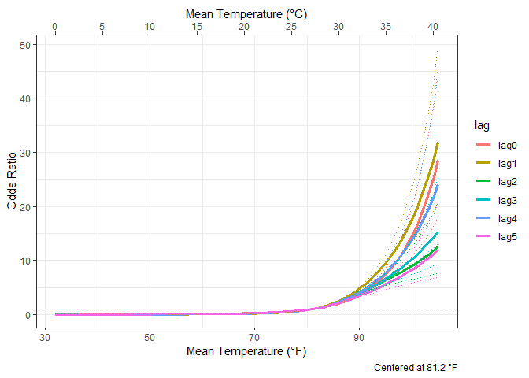<!-- -->

```
## 
## [[2]]
```

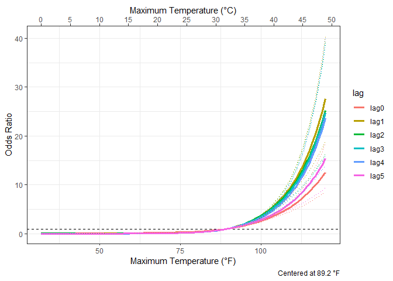<!-- -->

```
## 
## [[3]]
```

<!-- -->

```
## 
## [[4]]
```

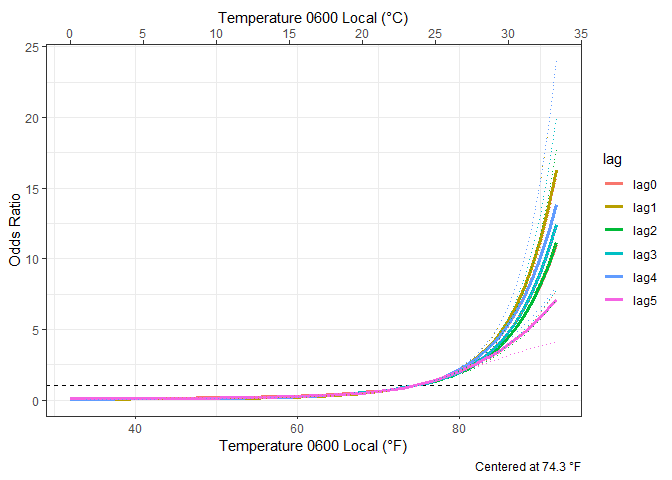<!-- -->

```
## 
## [[5]]
```

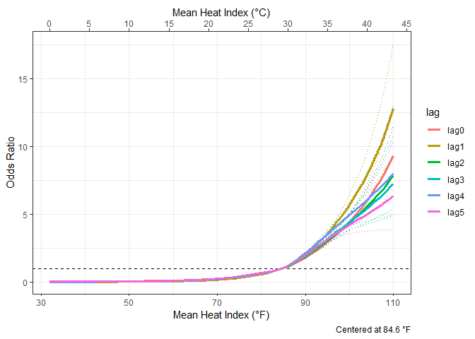<!-- -->

```
## 
## [[6]]
```

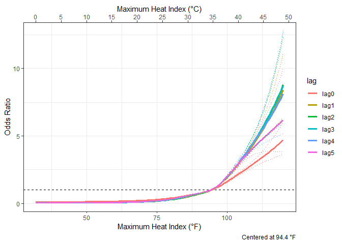<!-- -->

```
## 
## [[7]]
```

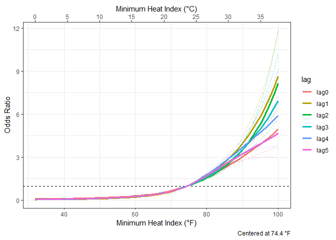<!-- -->

```
## 
## [[8]]
```

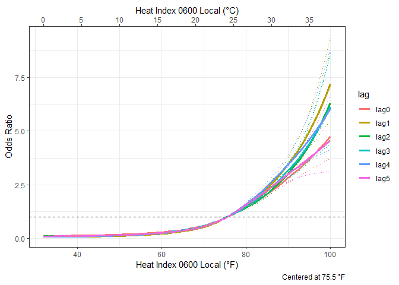<!-- -->

```
## 
## [[9]]
```

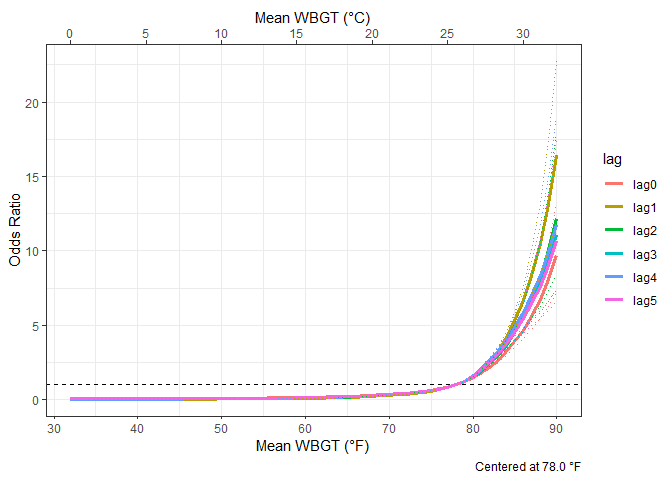<!-- -->

```
## 
## [[10]]
```

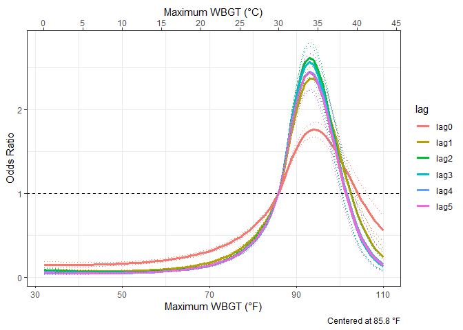<!-- -->

```
## 
## [[11]]
```

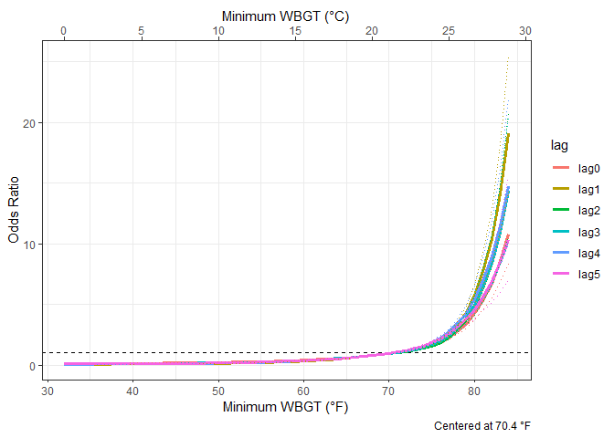<!-- -->

```
## 
## [[12]]
```

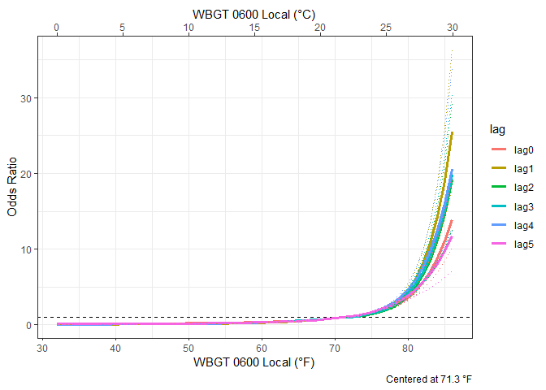<!-- -->
