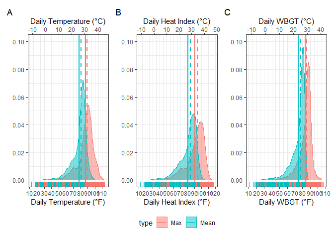
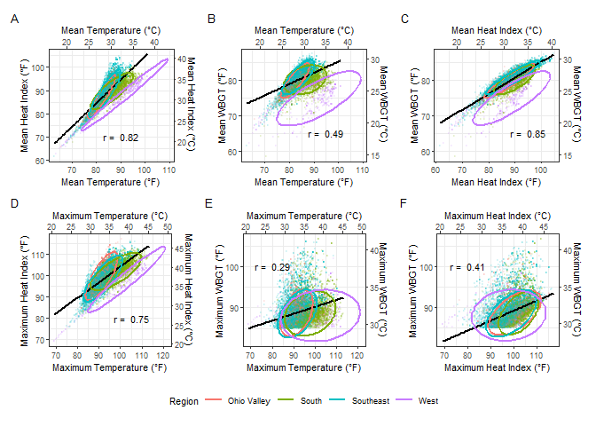
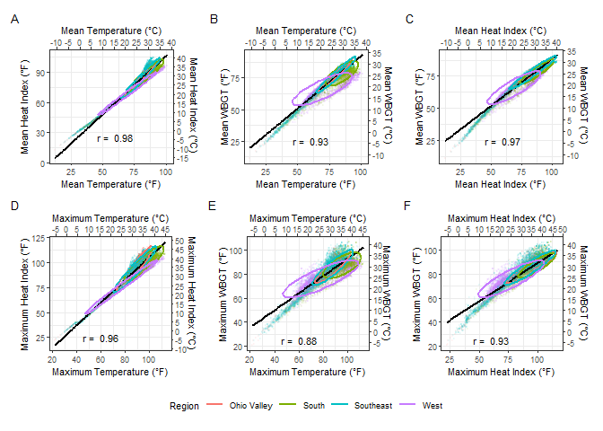

```r
daily_indices <- read_rds(file = "data/daily_indices_rod")

cc_exposure_df <-
  read_rds(file = "data/cc_exposure_df_rod.rds")

base_service_df <-
  read_rds(file = "data/base_service_df.rds")
```


## Figure 2 Density plots of case-day indices


```r
to_density_plot_all <-
  cc_exposure_df %>%
    filter(case == 1) %>% 
    dplyr::select(site_name, d_event, tmp_f_mean, tmp_f_max,
                  hi_f_mean, hi_f_max,
                  wbgt_f_mean, wbgt_f_max) %>%
   pivot_longer(-c(site_name, d_event), names_to = "Index", values_to = "Value") %>% 
    mutate(index = 
           case_when(
                   Index %in% c("tmp_f_mean", "tmp_f_max") ~ "Temperature",
      Index %in% c("hi_f_mean", "hi_f_max")  ~ "Heat Index",
      Index %in% c("wbgt_f_mean", "wbgt_f_max") ~ "WBGT"),
          type = 
           case_when(
                   Index %in% c("tmp_f_mean", "hi_f_mean", "wbgt_f_mean") ~ "Mean",
      Index %in% c("tmp_f_max", "hi_f_max", "wbgt_f_max")    ~ "Max"),
      index = fct_relevel(index, "Temperature", "Heat Index", "WBGT"),
      type = fct_relevel(type, "Max", "Mean")
    ) 
  


## Inspect percentages of cases above/below index value
to_density_plot_all %>% 
  filter(Index %in% "hi_f_max",  #32,426
         Value > 103) #4706
```

```
## # A tibble: 4,706 x 6
##    site_name    d_event    Index    Value index      type 
##    <chr>        <date>     <chr>    <dbl> <fct>      <fct>
##  1 Fort Benning 2011-08-09 hi_f_max  104. Heat Index Max  
##  2 Fort Benning 2012-07-25 hi_f_max  107. Heat Index Max  
##  3 Fort Benning 2009-07-16 hi_f_max  104. Heat Index Max  
##  4 Fort Benning 1999-08-13 hi_f_max  108. Heat Index Max  
##  5 Fort Benning 2011-08-03 hi_f_max  111. Heat Index Max  
##  6 Fort Benning 2005-08-22 hi_f_max  104. Heat Index Max  
##  7 Fort Benning 2005-07-26 hi_f_max  109. Heat Index Max  
##  8 Fort Benning 2007-08-13 hi_f_max  107  Heat Index Max  
##  9 Fort Benning 2010-08-03 hi_f_max  105. Heat Index Max  
## 10 Fort Benning 2011-08-05 hi_f_max  109. Heat Index Max  
## # ... with 4,696 more rows
```


### Patchwork density plots: with Celsius scale

```r
mean_median <- 
  to_density_plot_all %>% 
  group_by(index, type) %>% 
  summarise(mean = mean(Value),
            median = median(Value)) 
```

```
## `summarise()` has grouped output by 'index'. You can override using the
## `.groups` argument.
```

```r
density_temp <-
  to_density_plot_all %>% 
    filter(index %in% "Temperature") %>% 
    ggplot(aes(x = Value, fill = type, colour = type)) +
      geom_density(alpha = 0.5) +
      geom_vline(xintercept = (mean_median %>% filter(index %in% "Temperature" & type %in% "Mean"))$median, size = 1, 
                 color = "#00BFC4", linetype = "dashed") +
      geom_vline(xintercept = (mean_median %>% filter(index %in% "Temperature" & type %in% "Max"))$median, size = 1,
                 color = "#F8766D", linetype = "dashed") +
      geom_vline(xintercept = (mean_median %>% filter(index %in% "Temperature" & type %in% "Mean"))$mean, size = 1,
                 color = "#00BFC4") +
      geom_vline(xintercept = (mean_median %>% filter(index %in% "Temperature" & type %in% "Max"))$mean, size = 1,
                 color = "#F8766D") +
      geom_rug() +
      theme_bw() +
      labs(x = "Daily Temperature (°F)") +
      theme(axis.title.y = element_blank()) +
      scale_x_continuous(breaks = seq(from = 0, to = 120, by = 10),
                         sec.axis = sec_axis(trans = ~ (5/9) * (. - 32), name = "Daily Temperature (°C)",
                         breaks = seq(from = -20, to = 50, by = 10))) +
      scale_y_continuous(breaks = seq(from = 0.00, to = 0.10, by = 0.02), limits = c(0.00, 0.10)) 
                         

density_hi <-
  to_density_plot_all %>% 
    filter(index %in% "Heat Index") %>% 
    ggplot(aes(x = Value, fill = type, colour = type)) +
      geom_density(alpha = 0.5) +
      geom_vline(xintercept = (mean_median %>% filter(index %in% "Heat Index" & type %in% "Mean"))$median, size = 1, 
                 color = "#00BFC4", linetype = "dashed") +
      geom_vline(xintercept = (mean_median %>% filter(index %in% "Heat Index" & type %in% "Max"))$median, size = 1,
                 color = "#F8766D", linetype = "dashed") +
      geom_vline(xintercept = (mean_median %>% filter(index %in% "Heat Index" & type %in% "Mean"))$mean, size = 1,
                 color = "#00BFC4") +
      geom_vline(xintercept = (mean_median %>% filter(index %in% "Heat Index" & type %in% "Max"))$mean, size = 1,
                 color = "#F8766D") +
      geom_rug() +
      theme_bw() +
      labs(x = "Daily Heat Index (°F)") +
      theme(axis.title.y = element_blank()) +
      scale_x_continuous(breaks = seq(from = 0, to = 120, by = 10),
                         sec.axis = sec_axis(trans = ~ (5/9) * (. - 32), name = "Daily Heat Index (°C)",
                         breaks = seq(from = -20, to = 50, by = 10))) +
      scale_y_continuous(breaks = seq(from = 0.00, to = 0.10, by = 0.02), limits = c(0.00, 0.10))

density_wbgt <-
  to_density_plot_all %>% 
    filter(index %in% "WBGT") %>% 
    ggplot(aes(x = Value, fill = type, colour = type)) +
      geom_density(alpha = 0.5) +
      geom_vline(xintercept = (mean_median %>% filter(index %in% "WBGT" & type %in% "Mean"))$median, size = 1, 
                 color = "#00BFC4", linetype = "dashed") +
      geom_vline(xintercept = (mean_median %>% filter(index %in% "WBGT" & type %in% "Max"))$median, size = 1,
                 color = "#F8766D", linetype = "dashed") +
      geom_vline(xintercept = (mean_median %>% filter(index %in% "WBGT" & type %in% "Mean"))$mean, size = 1,
                 color = "#00BFC4") +
      geom_vline(xintercept = (mean_median %>% filter(index %in% "WBGT" & type %in% "Max"))$mean, size = 1,
                 color = "#F8766D") +
      geom_rug() +
      theme_bw() +
      labs(x = "Daily WBGT (°F)") +
      theme(axis.title.y = element_blank()) +
      scale_x_continuous(breaks = seq(from = 0, to = 120, by = 10),
                         sec.axis = sec_axis(trans = ~ (5/9) * (. - 32), name = "Daily WBGT (°C)",
                         breaks = seq(from = -20, to = 50, by = 10))) +
      scale_y_continuous(breaks = seq(from = 0.00, to = 0.10, by = 0.02), limits = c(0.00, 0.10))


# patchwork grid plot

plot_density_c <-
  (density_temp | density_hi | density_wbgt) + 
    plot_layout(guides = "collect") + 
    plot_annotation(tag_levels = 'A') & 
    theme(legend.position = "bottom")

plot_density_c
```

<!-- -->

```r
# ggsave("output/figures/plot_density_c.tiff", width = 9.5, height = 4)
```


## Figure 3: Pair-wise index correlations


### Upper temperature range
Filter to case days with WBGT-Max greater than 85 deg F


```r
to_scatter <-
  cc_exposure_df %>% 
    dplyr::select(site_name, case, source, age, sex, race_ethnic, service, grade, hsi, region,
                  tmp_f_mean, tmp_f_max, hi_f_mean, hi_f_max, wbgt_f_mean, wbgt_f_max) %>% 
       mutate(service = recode(service,
            "A" = "Army",
            "C" = "Coast Guard",
            "F" = "Air Force",
            "M" = "Marine Corps",
            "N" = "Navy"),
            source = recode(source,
            "INPATIENT" = "In-Patient",
            "OUTPATIENT" = "Out-Patient",
            "RME" = "Reportable Event"),
            hsi = recode(hsi,
            "heat_exhaustion" = "Heat Exhaustion",
            "heat_stroke" = "Heat Stroke"),
            sex = recode(sex,
            "F" = "Female",
            "M" = "Male",
            "Z" = "Unknown"),
            case = as_factor(case),
            case = recode(case,
                          "0" = "Control",
                          "1" = "Case")
                      ) %>% 
  mutate_if(is.character, as.factor) %>% 
            mutate(age = fct_relevel(age, ">=40", after = Inf)) %>% 
   rename("Max Temperature" = tmp_f_max,
         "Max Heat Index" = hi_f_max,
         "Max WBGT" = wbgt_f_max,
         "Mean Temperature" = tmp_f_mean,
         "Mean Heat Index" = hi_f_mean,
         "Mean WBGT" = wbgt_f_mean,
         "Region" = region) %>% 
          filter(case %in% "Case")    


to_scatter_cutoff <-
  to_scatter %>% 
        filter(case %in% "Case",
           `Max WBGT` > 85)


  # set values
alpha_val <- 0.1
ellipse_type <- "t"
point_size <- 0.5
ellipse_size <- 1.05
```

#Dual Scale


```r
plot_font_base <- 8
annotate_size <- 3

s1 <-
  to_scatter_cutoff %>% 
    dplyr::select(`Mean Temperature`, `Mean Heat Index`, `Mean WBGT`, Region) %>%
    ggplot(aes(x = `Mean Temperature`, y = `Mean Heat Index`)) +
      geom_point(alpha = alpha_val, size = point_size, aes(color = Region)) +
      geom_smooth(method = "lm", se = FALSE, color = "black") +
      stat_ellipse(type = ellipse_type, size = ellipse_size, aes(color = Region)) +
      annotate(x = 90, y = 70, 
           label=paste("r = ", round(cor(to_scatter_cutoff$`Mean Temperature`, to_scatter_cutoff$`Mean Heat Index`),2)), 
           geom = "text", size = annotate_size) +
      scale_x_continuous("Mean Temperature (°F)", sec.axis = sec_axis(trans = ~ (5/9) * (. - 32), name = "Mean Temperature (°C)", breaks = seq(from = -20, to = 50, by = 5))) +
      scale_y_continuous("Mean Heat Index (°F)", sec.axis = sec_axis(trans = ~ (5/9) * (. - 32), name = "Mean Heat Index (°C)", breaks = seq(from = -20, to = 50, by = 5))) + 
       theme_bw(base_size = plot_font_base)

s2 <-
to_scatter_cutoff %>% 
  dplyr::select(`Mean Temperature`, `Mean Heat Index`, `Mean WBGT`, Region) %>%
  ggplot(aes(x = `Mean Temperature`, y = `Mean WBGT`)) +
    geom_point(alpha = alpha_val, size = point_size, aes(color = Region)) +
   geom_smooth(method = "lm", se = FALSE, color = "black") +
   stat_ellipse(type = ellipse_type, size = ellipse_size, aes(color = Region)) +
  annotate(x = 95, y = 65, 
         label = paste("r = ", round(cor(to_scatter_cutoff$`Mean Temperature`, to_scatter_cutoff$`Mean WBGT`),2)), 
         geom = "text", size = annotate_size) +
  scale_x_continuous("Mean Temperature (°F)", sec.axis = sec_axis(trans = ~ (5/9) * (. - 32), name = "Mean Temperature (°C)", breaks = seq(from = -20, to = 50, by = 5))) +
  scale_y_continuous("Mean WBGT (°F)", sec.axis = sec_axis(trans = ~ (5/9) * (. - 32), name = "Mean WBGT (°C)", breaks = seq(from = -20, to = 50, by = 5))) + 
       theme_bw(base_size = plot_font_base)

s3 <-
to_scatter_cutoff %>%  
  dplyr::select(`Mean Temperature`, `Mean Heat Index`, `Mean WBGT`, Region) %>%
  ggplot(aes(x = `Mean Heat Index`, y = `Mean WBGT`)) +
    geom_point(alpha = alpha_val, size = point_size, aes(color = Region)) +
   geom_smooth(method = "lm", se = FALSE, color = "black") +
   stat_ellipse(type = ellipse_type, size = ellipse_size, aes(color = Region)) +
     annotate(x = 95, y = 65, 
         label = paste("r = ", round(cor(to_scatter_cutoff$`Mean Heat Index`, to_scatter_cutoff$`Mean WBGT`),2)), 
         geom = "text", size = annotate_size) +
    scale_x_continuous("Mean Heat Index (°F)", sec.axis = sec_axis(trans = ~ (5/9) * (. - 32), name = "Mean Heat Index (°C)", breaks = seq(from = -20, to = 50, by = 5))) +
  scale_y_continuous("Mean WBGT (°F)", sec.axis = sec_axis(trans = ~ (5/9) * (. - 32), name = "Mean WBGT (°C)", breaks = seq(from = -20, to = 50, by = 5))) + 
       theme_bw(base_size = plot_font_base)


# Max pairwise scatterplots

s4 <-
to_scatter_cutoff %>% 
  dplyr::select(`Max Temperature`, `Max Heat Index`, `Max WBGT`, Region) %>%
  ggplot(aes(x = `Max Temperature`, y = `Max Heat Index`)) +
    geom_point(alpha = alpha_val, size = point_size, aes(color = Region)) +
   geom_smooth(method = "lm", se = FALSE, color = "black") +
   stat_ellipse(type = ellipse_type, size = ellipse_size, aes(color = Region)) +
   annotate(x = 105, y = 80, 
         label = paste("r = ", round(cor(to_scatter_cutoff$`Max Temperature`, to_scatter_cutoff$`Max Heat Index`),2)), 
         geom = "text", size = annotate_size) +
      scale_x_continuous("Maximum Temperature (°F)", sec.axis = sec_axis(trans = ~ (5/9) * (. - 32), name = "Maximum Temperature (°C)", breaks = seq(from = -20, to = 50, by = 5))) +
  scale_y_continuous("Maximum Heat Index (°F)", sec.axis = sec_axis(trans = ~ (5/9) * (. - 32), name = "Maximum Heat Index (°C)", breaks = seq(from = -20, to = 50, by = 5))) + 
       theme_bw(base_size = plot_font_base)


s5 <-
to_scatter_cutoff %>% 
  dplyr::select(`Max Temperature`, `Max Heat Index`, `Max WBGT`, Region) %>%
  ggplot(aes(x = `Max Temperature`, y = `Max WBGT`)) +
    geom_point(alpha = alpha_val, size = point_size, aes(color = Region)) +
    geom_smooth(method = "lm", se = FALSE, color = "black") +
   stat_ellipse(type = ellipse_type, size = ellipse_size, aes(color = Region)) +
     annotate(x = 80, y = 100, 
         label = paste("r = ", round(cor(to_scatter_cutoff$`Max Temperature`, to_scatter_cutoff$`Max WBGT`),2)), 
         geom = "text", size = annotate_size) +
    scale_x_continuous("Maximum Temperature (°F)", sec.axis = sec_axis(trans = ~ (5/9) * (. - 32), name = "Maximum Temperature (°C)", breaks = seq(from = -20, to = 50, by = 5))) +
  scale_y_continuous("Maximum WBGT (°F)", sec.axis = sec_axis(trans = ~ (5/9) * (. - 32), name = "Maximum WBGT (°C)", breaks = seq(from = -20, to = 50, by = 5))) + 
       theme_bw(base_size = plot_font_base)

s6 <-
to_scatter_cutoff %>% 
  dplyr::select(`Max Temperature`, `Max Heat Index`, `Max WBGT`, Region) %>%
  ggplot(aes(x = `Max Heat Index`, y = `Max WBGT`)) +
    geom_point(alpha = alpha_val, size = point_size, aes(color = Region)) +
   geom_smooth(method = "lm", se = FALSE, color = "black") +
   stat_ellipse(type = ellipse_type, size = ellipse_size, aes(color = Region)) +
   annotate(x = 80, y = 100, 
         label = paste("r = ", round(cor(to_scatter_cutoff$`Max Heat Index`, to_scatter_cutoff$`Max WBGT`),2)), 
         geom = "text", size = annotate_size) +
  scale_x_continuous("Maximum Heat Index (°F)", sec.axis = sec_axis(trans = ~ (5/9) * (. - 32), name = "Maximum Heat Index (°C)", breaks = seq(from = -20, to = 50, by = 5))) +
  scale_y_continuous("Maximum WBGT (°F)", sec.axis = sec_axis(trans = ~ (5/9) * (. - 32), name = "Maximum WBGT (°C)", breaks = seq(from = -20, to = 50, by = 5))) + 
       theme_bw(base_size = plot_font_base)


# patchwork grid plot

plot_scatter_dual <-
  (s1 | s2 | s3) / (s4 | s5 | s6) + 
    plot_layout(guides = "collect") + 
    plot_annotation(tag_levels = 'A') & 
    theme(legend.position = "bottom")

plot_scatter_dual
```

```
## `geom_smooth()` using formula 'y ~ x'
## `geom_smooth()` using formula 'y ~ x'
## `geom_smooth()` using formula 'y ~ x'
## `geom_smooth()` using formula 'y ~ x'
## `geom_smooth()` using formula 'y ~ x'
## `geom_smooth()` using formula 'y ~ x'
```

<!-- -->

```r
#ggsave(filename = "output/figures/plot_scatter_c.tiff", device = "tiff", dpi = 700)
```


### Scatterplot all points (no temp cutoff), Dual Scale


```r
plot_font_base <- 8
annotate_size <- 3

  # set alpha value
alpha_val <- 0.05
ellipse_type <- "t"
point_size <- 0.3
ellipse_size <- 1.0

s1 <-
  to_scatter %>% 
    dplyr::select(`Mean Temperature`, `Mean Heat Index`, `Mean WBGT`, Region) %>%
    ggplot(aes(x = `Mean Temperature`, y = `Mean Heat Index`)) +
      geom_point(alpha = alpha_val, size = point_size, aes(color = Region)) +
      geom_smooth(method = "lm", se = FALSE, color = "black") +
      stat_ellipse(type = ellipse_type, size = ellipse_size, aes(color = Region)) +
      annotate(x = 60, y = 25, 
           label=paste("r = ", round(cor(to_scatter$`Mean Temperature`, to_scatter$`Mean Heat Index`),2)), 
           geom = "text", size = annotate_size) +
      scale_x_continuous("Mean Temperature (°F)", sec.axis = sec_axis(trans = ~ (5/9) * (. - 32), name = "Mean Temperature (°C)", breaks = seq(from = -20, to = 50, by = 5))) +
      scale_y_continuous("Mean Heat Index (°F)", sec.axis = sec_axis(trans = ~ (5/9) * (. - 32), name = "Mean Heat Index (°C)", breaks = seq(from = -20, to = 50, by = 5))) + 
       theme_bw(base_size = plot_font_base)

s2 <-
to_scatter %>% 
  dplyr::select(`Mean Temperature`, `Mean Heat Index`, `Mean WBGT`, Region) %>%
  ggplot(aes(x = `Mean Temperature`, y = `Mean WBGT`)) +
    geom_point(alpha = alpha_val, size = point_size, aes(color = Region)) +
   geom_smooth(method = "lm", se = FALSE, color = "black") +
   stat_ellipse(type = ellipse_type, size = ellipse_size, aes(color = Region)) +
  annotate(x = 60, y = 25, 
         label = paste("r = ", round(cor(to_scatter$`Mean Temperature`, to_scatter$`Mean WBGT`),2)), 
         geom = "text", size = annotate_size) +
  scale_x_continuous("Mean Temperature (°F)", sec.axis = sec_axis(trans = ~ (5/9) * (. - 32), name = "Mean Temperature (°C)", breaks = seq(from = -20, to = 50, by = 5))) +
  scale_y_continuous("Mean WBGT (°F)", sec.axis = sec_axis(trans = ~ (5/9) * (. - 32), name = "Mean WBGT (°C)", breaks = seq(from = -20, to = 50, by = 5))) + 
       theme_bw(base_size = plot_font_base)

s3 <-
to_scatter %>%  
  dplyr::select(`Mean Temperature`, `Mean Heat Index`, `Mean WBGT`, Region) %>%
  ggplot(aes(x = `Mean Heat Index`, y = `Mean WBGT`)) +
    geom_point(alpha = alpha_val, size = point_size, aes(color = Region)) +
   geom_smooth(method = "lm", se = FALSE, color = "black") +
   stat_ellipse(type = ellipse_type, size = ellipse_size, aes(color = Region)) +
     annotate(x = 60, y = 25, 
         label = paste("r = ", round(cor(to_scatter$`Mean Heat Index`, to_scatter$`Mean WBGT`),2)), 
         geom = "text", size = annotate_size) +
    scale_x_continuous("Mean Heat Index (°F)", sec.axis = sec_axis(trans = ~ (5/9) * (. - 32), name = "Mean Heat Index (°C)", breaks = seq(from = -20, to = 50, by = 5))) +
  scale_y_continuous("Mean WBGT (°F)", sec.axis = sec_axis(trans = ~ (5/9) * (. - 32), name = "Mean WBGT (°C)", breaks = seq(from = -20, to = 50, by = 5))) + 
       theme_bw(base_size = plot_font_base)


s4 <-
to_scatter %>% 
  dplyr::select(`Max Temperature`, `Max Heat Index`, `Max WBGT`, Region) %>%
  ggplot(aes(x = `Max Temperature`, y = `Max Heat Index`)) +
    geom_point(alpha = alpha_val, size = point_size, aes(color = Region)) +
   geom_smooth(method = "lm", se = FALSE, color = "black") +
   stat_ellipse(type = ellipse_type, size = ellipse_size, aes(color = Region)) +
   annotate(x = 60, y = 25, 
         label = paste("r = ", round(cor(to_scatter$`Max Temperature`, to_scatter$`Max Heat Index`),2)), 
         geom = "text", size = annotate_size) +
      scale_x_continuous("Maximum Temperature (°F)", sec.axis = sec_axis(trans = ~ (5/9) * (. - 32), name = "Maximum Temperature (°C)", breaks = seq(from = -20, to = 50, by = 5))) +
  scale_y_continuous("Maximum Heat Index (°F)", sec.axis = sec_axis(trans = ~ (5/9) * (. - 32), name = "Maximum Heat Index (°C)", breaks = seq(from = -20, to = 50, by = 5))) + 
       theme_bw(base_size = plot_font_base)


s5 <-
to_scatter %>% 
  dplyr::select(`Max Temperature`, `Max Heat Index`, `Max WBGT`, Region) %>%
  ggplot(aes(x = `Max Temperature`, y = `Max WBGT`)) +
    geom_point(alpha = alpha_val, size = point_size, aes(color = Region)) +
    geom_smooth(method = "lm", se = FALSE, color = "black") +
   stat_ellipse(type = ellipse_type, size = ellipse_size, aes(color = Region)) +
     annotate(x = 60, y = 25,  
         label = paste("r = ", round(cor(to_scatter$`Max Temperature`, to_scatter$`Max WBGT`),2)), 
         geom = "text", size = annotate_size) +
    scale_x_continuous("Maximum Temperature (°F)", sec.axis = sec_axis(trans = ~ (5/9) * (. - 32), name = "Maximum Temperature (°C)", breaks = seq(from = -20, to = 50, by = 5))) +
  scale_y_continuous("Maximum WBGT (°F)", sec.axis = sec_axis(trans = ~ (5/9) * (. - 32), name = "Maximum WBGT (°C)", breaks = seq(from = -20, to = 50, by = 5))) + 
       theme_bw(base_size = plot_font_base)

s6 <-
to_scatter %>% 
  dplyr::select(`Max Temperature`, `Max Heat Index`, `Max WBGT`, Region) %>%
  ggplot(aes(x = `Max Heat Index`, y = `Max WBGT`)) +
    geom_point(alpha = alpha_val, size = point_size, aes(color = Region)) +
   geom_smooth(method = "lm", se = FALSE, color = "black") +
   stat_ellipse(type = ellipse_type, size = ellipse_size, aes(color = Region)) +
   annotate(x = 60, y = 25,  
         label = paste("r = ", round(cor(to_scatter$`Max Heat Index`, to_scatter$`Max WBGT`),2)), 
         geom = "text", size = annotate_size) +
  scale_x_continuous("Maximum Heat Index (°F)", sec.axis = sec_axis(trans = ~ (5/9) * (. - 32), name = "Maximum Heat Index (°C)", breaks = seq(from = -20, to = 50, by = 5))) +
  scale_y_continuous("Maximum WBGT (°F)", sec.axis = sec_axis(trans = ~ (5/9) * (. - 32), name = "Maximum WBGT (°C)", breaks = seq(from = -20, to = 50, by = 5))) + 
       theme_bw(base_size = plot_font_base)


# patchwork grid plot

plot_scatter_dual_full <-
  (s1 | s2 | s3) / (s4 | s5 | s6) + 
    plot_layout(guides = "collect") + 
    plot_annotation(tag_levels = 'A') & 
    theme(legend.position = "bottom")

plot_scatter_dual_full
```

```
## `geom_smooth()` using formula 'y ~ x'
## `geom_smooth()` using formula 'y ~ x'
## `geom_smooth()` using formula 'y ~ x'
## `geom_smooth()` using formula 'y ~ x'
## `geom_smooth()` using formula 'y ~ x'
## `geom_smooth()` using formula 'y ~ x'
```

<!-- -->

```r
#ggsave(filename = "output/figures/plot_scatter_c_full.tiff", device = "tiff", dpi = 700)
```

## Figure 4. Overall HSI odds ratios
Patchwork plot


```r
# Read in ggplot objects

plot_mean_temp <-
  read_rds("output/main/plot_tmp_f_mean.rds")

plot_max_temp <-
  read_rds("output/main/plot_tmp_f_max.rds")

plot_mean_hi <-
  read_rds("output/main/plot_hi_f_mean.rds")

plot_max_hi <-
  read_rds("output/main/plot_hi_f_max.rds")

plot_mean_wbgt <-
  read_rds("output/main/plot_wbgt_f_mean.rds")

plot_max_wbgt <-
  read_rds("output/main/plot_wbgt_f_max.rds")


plot_df <-
  (plot_mean_temp | plot_mean_hi | plot_mean_wbgt) / 
  (plot_max_temp | plot_max_hi | plot_max_wbgt) + plot_layout(guides = "collect") + plot_annotation(tag_levels = 'A') & theme(legend.position = "bottom")

plot_df

#ggsave(filename = "output/figures/fig4_print.tiff", width = 7.58, height = 6.82, units = "in", device = "tiff", dpi = 500)
```


